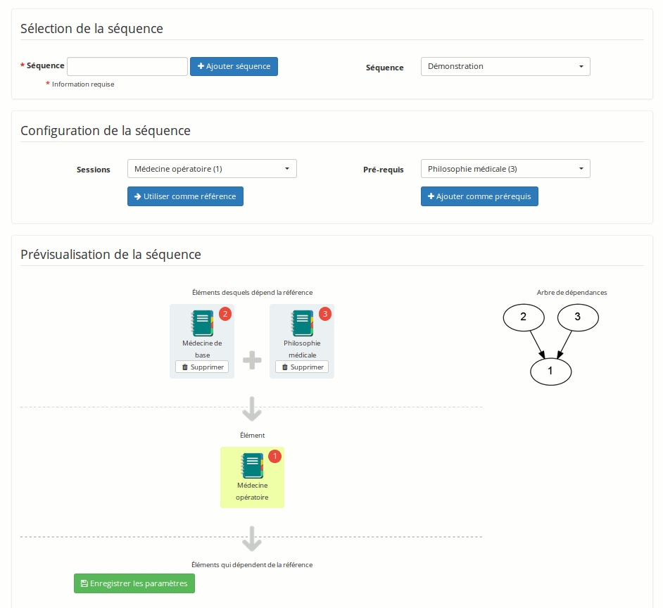

## Administrer les options système {#administration-des-options-syst-me}

### Exports spéciaux {#exports-sp-ciaux}

La fonctionnalité d'export spécial a été dessinée dans l'intention de venir en aide au réviseur académique / instructionnel, et lui permet d'exporter tous les documents de tous les cours en une seule opération. Une seconde option permet de choisir les documents des cours qu'il désire exporter, et exportera les documents présents dans ces cours directement depuis l'outil de maintenance du cours lui-même.

*Illustration 79: Administration - Exports spéciaux*

### État du système {#tat-du-syst-me}

La page d'état du système permet de consulter quelques détails par rapport à la plateforme et au serveur sur lequel elle est installée.

*Illustration 80: Administration - État du système*

Ces informations sont particulièrement utiles aux équipes de support techniques pour diagnostiquer un problème lorsqu'il est impossible d'avoir un accès au serveur lui-même.

### Remplisseur de données {#remplisseur-de-donn-es}

Le remplisseur de données n'est disponible que sur des plateformes de développement. Il dépend de la présence du répertoire _tests/_ à la racine du répertoire de Chamilo.

### Vidange du répertoire archive {#vidange-du-r-pertoire-archive}

Cette fonctionnalité permet de nettoyer les fichiers temporaires créés sur la plateforme. Elle est particulièrement utile dans le cas de modifications visuelles via des modèles \(« templates »\) différents de celui disponible par défaut, et lorsque le répertoire temporaire contenant des formats partiels d'export de données est rempli, après avoir généré de nombreux exports pendant un certain temps. En effet, sans cela et en l'absence d'un processus chronologique de nettoyage du répertoire _app/cache/_ sur le serveur, ce répertoire se remplit progressivement jusqu'à \(potentiellement\) occuper toute la place disponible sur le disque dur du serveur.

Il est donc bon de penser à exécuter ce script de temps en temps \(une fois par mois, par exemple\).

### Séquencialisation de ressources {#s-quencialisation-de-ressources}

Cet outil est apparu sous forme expérimentale avec la version 1.10 de Chamilo. Il permet de configurer une séquencialisation des sessions, de telle manière qu'un apprenant ne puisse s'inscrire à une session que s'il a complété une ou plusieurs autres sessions.

Afin d'utiliser cette fonctionnalité il est nécessaire :

* d'activer le catalogue de sessions

* de permettre les inscriptions libres aux sessions

* de disposer de plusieurs sessions

* que chaque session dispose d'au moins un cours

* que chaque cours dans chaque session offre un cahier de notes complètement configuré

* de configurer des dépendances réalistes et non-cycliques dans l'outil de séquencialisation

Bien que l'outil soit fonctionnel, il requiert de nombreuses étapes de configuration, et nous recommandons à nos administrateurs de configurer d'abord un modèle sur un portail de test avant de l'utiliser en production.

L'outil est particulièrement appliqué, dans son état actuel, pour une utilisation sur un portail en libre accès mais pour lequel on souhaite que l'apprenant puisse compléter un véritable parcours d'apprentissage pour atteindre un objectif final dans le contexte d'une formation complète.

*Illustration 81: Exemple d'écran de définition des séquences*

Cet outil, dans son état actuel, offre encore trop peu d'options pour satisfaire la plupart de nos utilisateurs.

