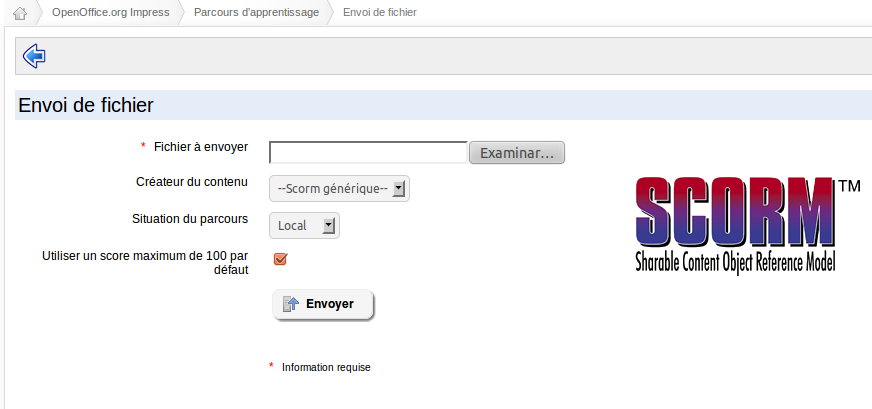

### Learning paths {#learning-paths}

After exporting the learning paths, you might want to know how to import them back into another (or the same) Chamilo portal.

In the _My courses_ tab, create an empty course matching the one which has to be imported (or re-use an existing course). Once in the course, click _Learning paths_.

In the learning paths tool, you have three options:

*   « Create new course » (1st icon),

*   « Import [SCORM](http://fr.wikipedia.org/wiki/Sharable_Content_Object_Reference_Model) courses » (2nd icon),

*   « Chamilo Rapid[^16] » (3rd icon)

Illustration 27: Interface – Learning paths import

To import the learning path previously exported, click on _Import SCORM course_ (2nd icon).

Illustration 28: Interface – SCORM learning paths import

The backup must obviously be compatible with SCORM and, something less obvious, SCORM 1.2, which is a particular version of SCORM. Chamilo does not fully support SCORM 2004, so you will probably have a valid learning path import, but it will not remain fully functional, most of the time. Your learning path package can also be AICC compatible, but that&#039;s another story.

Note the _Authoring tool_ field is only an informational field and doesn&#039;t generate any behaviour modification.

[^16]: This option is only visible if you have installed and configured Chamilo Rapid. See Chapter 9.3 Chamilo Rapid.