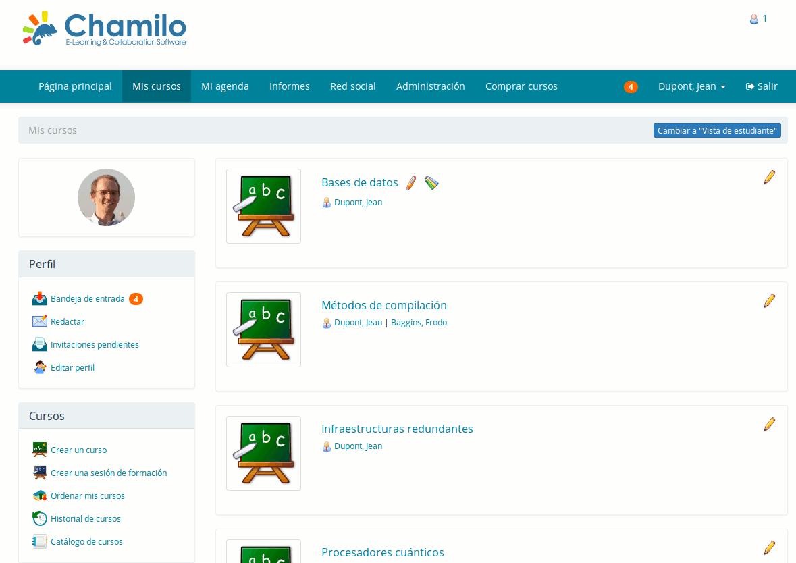
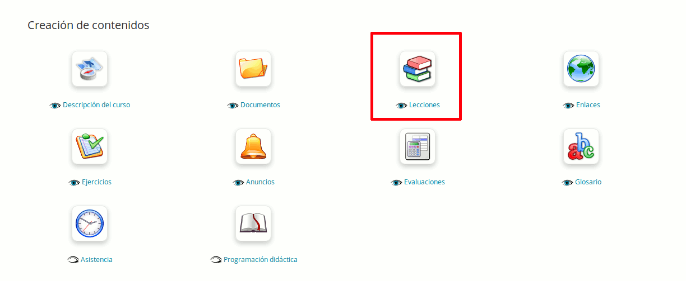
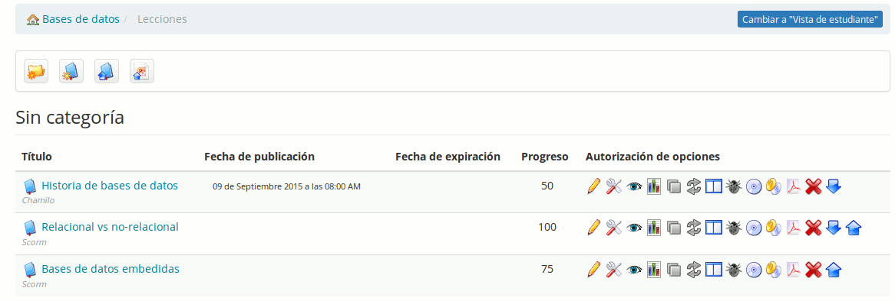
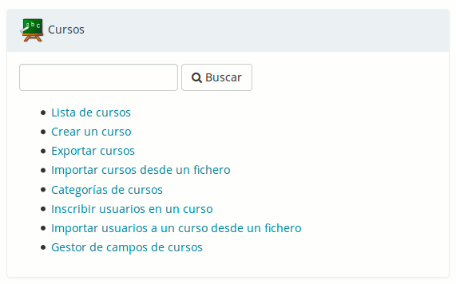
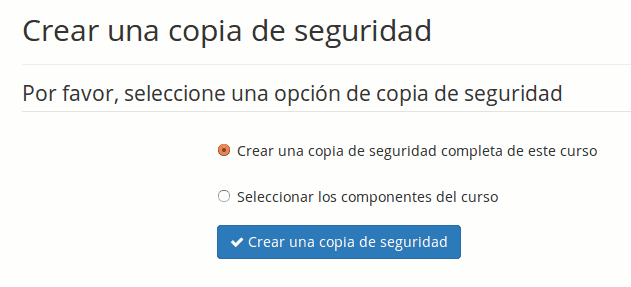
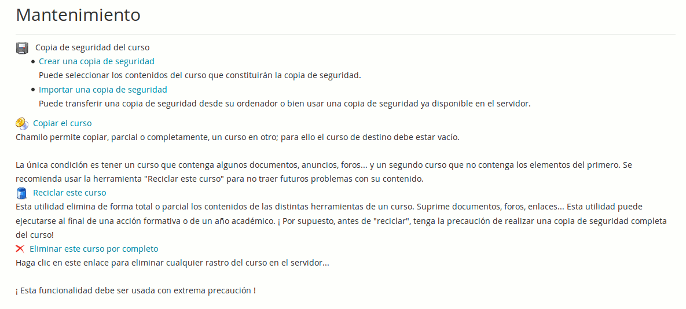
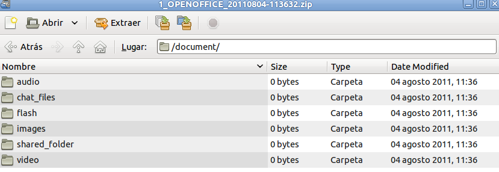
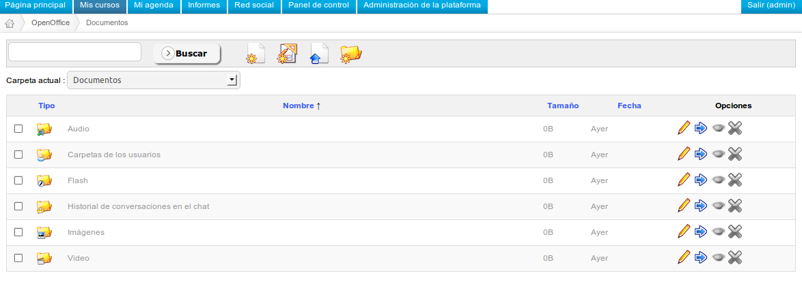

## Copias de seguridad por la interfaz de Chamilo {#copias-de-seguridad-0}

Chamilo ofrece distintas maneras de sacar copias de seguridad de sus datos. Si es administrador o docente, podrá guardar un curso completo (salvo algún elemento) o un elemento de un curso en particular.

#### Exportar una lección {#exportar-una-lecci-n}

Para exportar una lección, ir a la pestaña Mis cursos.

*Ilustración 16: Interfaz - Lista de cursos*

Aquí, puede ver los cursos en los que usted es el docente (junto a cada uno aparecerá un icono en forma de lápiz). Para continuar, haga clic en uno de ellos y entre en la herramienta de lecciones.

*Ilustración 17: Interfaz - Lista de herramientas del curso*

Una vez en la lista de lecciones o secuencias de aprendizaje, haga clic en el icono en forma de CD para generar un archivo de copia de seguridad de esa lección.

*Ilustración 18: Interfaz - Exportar lecciones*

En esta etapa, sólo tiene que seleccionar dónde guardar el archivo. La exportación está disponible como un archivo .zip.

Esta exportación se genera en el formato SCORM 1.2 (lo que también implica que estará comprimido en un .zip) que podrá utilizar en otra plataforma Chamilo o en cualquier otro LMS compatible con SCORM 1.2\. Esta copia de seguridad no podrá volver a ser modificada en la mayoría de los casos.

#### **Copia de seguridad de un curso** {#copia-de-seguridad-de-un-curso}

Si usted es administrador de la plataforma podrá guardar cualquier curso usando el menú de Administración de la plataforma y la interfaz de cursos.

1. Ir a : &quot; Administración &quot; → &quot; Lista de cursos &quot; :

*Ilustración 19: Administración - Bloque cursos*

1. Haga clic sobre el icono en forma de CD.

*Ilustración 20: Administración - Lista de cursos – Copia de seguridad*

1. Chamilo ofrecerá la posibilidad de crear o importar una copia de seguridad. Haga clic en “Crear copia de seguridad”.

*Ilustración 21: Administración – Copia de seguridad*

1. Según sus necesidades, podrá elegir entre una copia de seguridad completa y una selección de herramientas específicas. Vamos a elegir una copia de seguridad completa para el ejemplo.

*Ilustración 22: Administración - Opciones de copia de seguridad*

1. La copia de seguridad es generada, tras lo cual sólo habrá que hacer clic en el botón descargar.

*Ilustración 23: Administración - Resultados de la generación de una copia de seguridad*

1. Al hacer clic en el botón “Crear una copia de seguridad”, Chamilo genera un archivo de backup en el directorio chamilo/archive/ que podrá recuperar simplemente mediante un acceso directo. Sin embargo, otras personas también podrían hacerlo si adivinaran su nombre (código del curso + tiempo en segundos en que se ha generado), por lo que como administrador responsable, debe limpiar regularmente este directorio (se propone un proceso en main/cron pero tiene que ejecutarlo usted) y establecer una configuración que evite la navegación dentro del directorio main/archive/, utilizando para ello un archivo .htaccess o configurando adecuadamente el VirtualHost.

Otra forma de realizar una copia de seguridad de un curso, que también está permitida a los docentes de un curso concreto es la siguiente:

Haga clic en la pestaña _Mis cursos_ y seleccione uno de los cursos disponibles. Haga clic en la herramienta _Administración del curso._

*Ilustración 24: Interfaz - Herramientas de administración del curso*

Seleccione la opción _Mantenimiento del curso._

*Ilustración 25: Interfaz - Opciones mantenimiento de un curso*

Las opciones de mantenimiento del curso, además de la copia de seguridad, le permiten realizar tres funciones adicionales:

- **Copiar el curso** posibilita duplicar la totalidad o parte de un curso en otro que previamente es preferible que esté vacío. Sólo se requiere que el curso origen tenga algún contenido que copiar y que el curso de destino no contenga ya elementos del original.
- **Reciclar este curso** permite vaciar todo el contenido de un curso. Supongamos que desea organizar un nuevo curso reutilizando uno ya existente, por lo que necesitará eliminar todos los recursos creados previamente en el mismo. No olvide que no hay posibilidad de recuperar los elementos borrados, así que antes de hacerlo es posible que desee realizar una copia de seguridad del curso.
- **Suprimir** permite eliminar todo el curso. La confirmación es necesaria, pero una vez eliminado, no espere que esté disponible como una copia de seguridad en algún lugar ...

> **Nota**: al abrir la copia de seguridad del archivo .zip, usted encontrará una gran similitud con la herramienta _documentos_ de la jerarquía de los documentos. Para su información, el valor predeterminado .zip para un curso creado inicialmente con el contenido de ejemplo ocupa alrededor de 10MB.

Este fichero contiene:

- Una estructura interna de archivos denominada course_info.dat
- Un directorio llamado _Document_
- Una serie de archivos y carpetas que contienen los documentos del curso, no todo lo relacionado con los usuarios (las tareas y otros elementos relacionados con los usuarios no son guardados)

El directorio _Document_ tiene una estructura similar a la que se presenta en la ilustración 7, que reproduce la estructura de la herramienta documentos como se muestra en la ilustración 2.

*Ilustración 26: Copia de seguridad - Estructura de archivos de la copia de seguridad*

*Ilustración 27: Interfaz - Lista de documentos*

Estos documentos son los contenidos por defecto en el curso.

Por otro lado, piense que la copia de seguridad sólo recuperará los documentos (imágenes, vídeos, etc) relacionados con el curso.