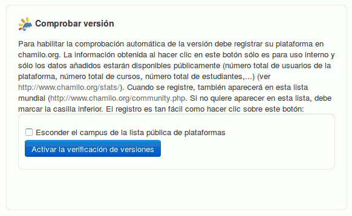
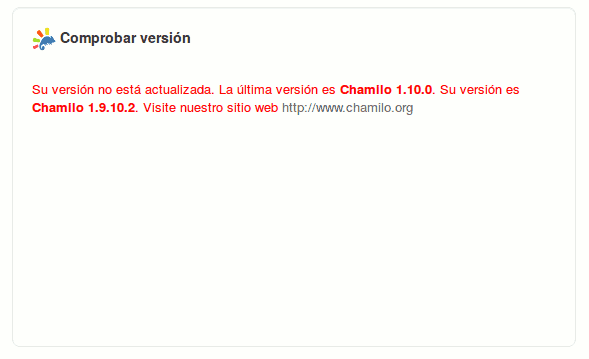

### Actualizar Chamilo {#actualizar-chamilo}

Si usted ya tiene una instalación de Chamilo y se produce el lanzamiento de una nueva versión, le recomendamos encarecidamente que la actualice, no sólo para beneficiarse de las nuevas características sino también de las actualizaciones de seguridad[^8].

Cualquier actualización de software puede generar nuevos errores o regresiones habida cuenta el gran número de contextos en los que puede correr y la dinamicidad de los mismos. Por tanto, antes de actualizar Chamilo es **muy recomendable** realizar una **copia de seguridad** de todo su sistema (carpetas de _Chamilo_ y _bases de datos_).

Como administrador, puede activar la notificación de nuevas versiones en la ficha Administración, bloque _Chamilo_.

*Ilustración 10: Administración - Bloque Chamilo*

Para activar esta funcionalidad, haga clic en el botón de Activar la verificación de versiones.

*Ilustración 11: Administración - Bloque Chamilo (continuación)*

Siempre que una nueva versión sea publicada, su interfaz se lo comunicará. Tenga en cuenta que esta característica, también enviará algunos datos sobre su portal para que podamos usarlos con fines estadísticos: el e-mail público que ha hecho figurar en la administración de la plataforma, la dirección URL pública de la misma, así como el número de usuarios y cursos. De esta manera, podremos saber cuántas personas están usando Chamilo en todo el mundo.

#### Descargar la última versión estable {#descargar-la-ltima-versi-n-estable}

Ir a buscar el último paquete estable a la página web de [Chamilo](https://chamilo.org/es/chamilo-lms). Una vez que lo consiguió, descomprimirlo y pasar al siguiente capítulo.

#### Reemplazar una versión anterior por otra nueva {#reemplazar-una-versi-n-anterior-por-otra-nueva}

Hay una sola manera de actualizar una versión de Chamilo:

1. No elimine la carpeta anterior, de lo contrario los archivos de configuración de los que ya dispone se perderán.
2. Copie el nuevo directorio de Chamilo sobre el antiguo.
   - Si utiliza una distribución de GNU / Linux, tendrá que copiar el directorio completo a la antigua, es decir:

| user@server: sudo cp -r chamilo-1.10.0/* /var/www/chamilo/user@server: sudo cp chamilo-1.10.0/.htaccess /var/www/chamilo/ |
| --- |

O, con SSH, use el comando “scp”

1. A continuación, siga los pasos de _&quot;__Asistente de instalación__&quot;_ en página 9.
2. Conéctese a su sitio y compruebe que todo está allí.

[^1]: File Transfer Protocol (Protocolo de Transferencia de Archivos) es un protocolo sin garantía de seguridad pero muy eficiente para la transferencia de archivos.
[^2]: Secure File Transfer Protocol, basado en SSH (Secure Shell), permite la transmisión de archivos de una manera similar a FTP pero incorporando seguridad a la transferencia.
[^3]: https://campus.chamilo.org/documentation/optimization.html
[^4]: http://memcached.org/
[^5]: http://www.7-zip.org/
[^6]: http://php.net/manual/en/ini.core.php
[^7]: Http://www.fsf.org/
[^8]: Revisa http://support.chamilo.org/projects/chamilo-18/wiki/Security_issues frecuentemente si es un poco paranoico