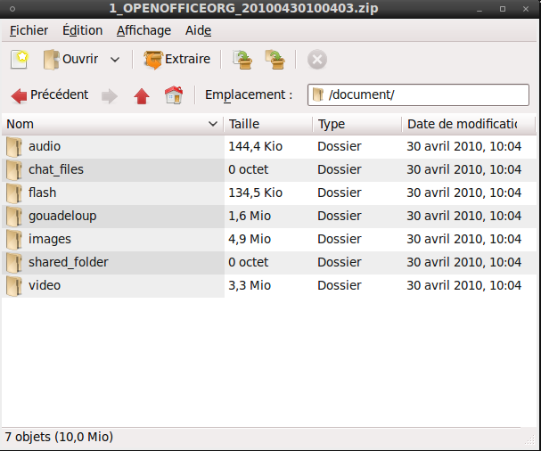

## Sauvegarde par l&#039;interface de Chamilo {#sauvegarde-par-l-interface-de-chamilo}

Chamilo propose différentes façons de sauvegarder les données. Il est possible de sauvegarder le cours complet (ou presque) ou un élément de cours en particulier, mais seulement en tant qu&#039;administrateur ou enseignant.

### Export d&#039;un parcours {#export-d-un-parcours}

Pour exporter un parcours, aller dans l&#039;onglet « Mes cours »:

Illustration 15: Interface - Liste des cours

Ici, on peut voir tous les cours dont on est l&#039;enseignant principal. Pour continuer, il faut cliquer sur l&#039;un d&#039;eux pour entrer dans le cours puis sur « Parcours » :

Illustration 16: Liste des outils de cours

Une fois dans les parcours, il faut cliquer sur l&#039;icône représentant un « CD » pour générer la sauvegarde :

Illustration 17: Interface - Export des parcours

Ensuite, il ne reste plus qu&#039;à sauvegarder ce cours dans le dossier désiré sur votre ordinateur (par défaut « Téléchargement »).

Cet export se fait au format SCORM 1.2 (qui définit aussi qu&#039;il doit être compressé sous format de fichier compressé .zip), que l&#039;on pourra ensuite réutiliser dans Chamilo ou un autre LMS compatible SCORM 1.2 (c&#039;est-à-dire à peu près n&#039;importe quel autre portail e-learning).

Veuillez noter que ce format rend l&#039;édition complexe, pour ne pas dire impossible. Il s&#039;agit donc d&#039;une sauvegarde à considérer comme non modifiable dans la plupart des circonstances.

### **S****auvegarde d&#039;un cours** {#sauvegarde-d-un-cours}

L&#039;administrateur de la plateforme peut procéder à une sauvegarde pour n&#039;importe quel cours, depuis (entre autres méthodes) l&#039;interface d&#039;administration.

1.  Allez dans : « Administration » → « Liste des cours » :

Illustration 18: Administration - Bloc cours

1.  Ensuite, cliquez sur l&#039;icône « CD » de la colonne de droite au niveau du cours à exporter :

Illustration 19: Administration - Liste des cours – Sauvegarde

1.  Un choix est possible entre la sauvegarde complète et la sélection (en fonction de la situation et des besoins). Pour cet exemple nous choisirons : &quot;Faire une sauvegarde complète de ce cours&quot;.

Illustration 20: Administration - Paramètres de sauvegarde

1.  La sauvegarde est générée. Il ne reste plus qu&#039;à cliquer sur le bouton pour la télécharger sous forme de fichier ZIP.

Illustration 21: Administration - Sauvegarde, résultat de la sauvegarde

1.  Après avoir cliqué sur « Générer sauvegarde », Chamilo crée un fichier de sauvegarde, par défaut, dans son répertoire : « chamilo/app/cache ». Vous pouvez donc l&#039;y récupérer par accès direct, ce qui veut dire que d&#039;autres utilisateurs peuvent y avoir accès également (à condition de connaître le nom du fichier). Il est donc important de mettre en place un mécanisme de nettoyage régulier de ce répertoire. Nous proposons un script qui fait cela dans _main/cron_, mais il faudra encore configurer votre serveur pour qu&#039;il exécute ce script de manière automatique et régulière (quotidiennement, par exemple).

Il est également possible de générer une sauvegarde du cours par un autre chemin...

En tant qu&#039;administrateur ou enseignant, cliquez sur l&#039;onglet « Mes cours » puis sur l&#039;un des cours disponibles. Ensuite, il est proposé de générer une sauvegarde avec la même méthode expliquée au-dessus en cliquant sur « Maintenance ».

Illustration 22: Interface - Outil d&#039;administration du cours

Une interface légèrement différente est proposée.

Illustration 23: Interface - Options de maintenance de cours

Il est donc possible de générer une sauvegarde comme cela est expliqué ci-dessus. Trois autres options sont encore disponibles :

*   **« Copier un cours »** permet de dupliquer tout ou partie d&#039;un cours existant vers une autre partie qui peut être initialement vide. Le seul préalable à cette manipulation est de disposer d&#039;un cours contenant des documents, annonces, forums, ... et d&#039;un second cours ne contenant pas les éléments du premier cours.

*   **« Vider ce cours »** : assez explicite, cet outil permet de vider le cours des éléments sélectionnés ou de l&#039;ensemble des éléments qu&#039;il contient. Il supprime les documents, forums, liens...

    → Cette procédure peut être mise en œuvre à la fin d&#039;un cours. Bien entendu, avant de le vider, il est préférable d&#039;effectuer une sauvegarde complète.

*   **« Supprimer »** : permet d&#039;éliminer toute trace du cours sur le serveur.

    → Attention en utilisant cet outil, une confirmation est demandée, mais une fois supprimé, il est impossible de récupérer le cours depuis l&#039;interface de Chamilo.

**Remarque** : lorsqu&#039;on ouvre le .zip de sauvegarde, on observera une ressemblance avec les dossiers mis par défaut dans « Documents » à la création des cours.

Pour information, le .zip de l&#039;exemple pèse 9,2 Mo.

Il contient :

*   un fichier course_info.dat

*   un dossier &quot;Document&quot;

*   une série de dossiers reprenant les documents du cours, non liés aux utilisateurs (les travaux et autres ressources propres aux utilisateurs ne sont pas sauvegardés)

Le dossier &quot;Document&quot; est organisé comme représenté dans l&#039;illustration 24, qui reproduit la structure des documents dans l&#039;illustration 25.

Illustration 24: Sauvegarde - Structure des fichiers de sauvegarde

Illustration 25: Interface - Liste de documents

Ces dossiers et documents sont les contenus du cours.

De plus, la sauvegarde ne récupérera que les documents (images, vidéos, etc.) en correspondance avec le cours.