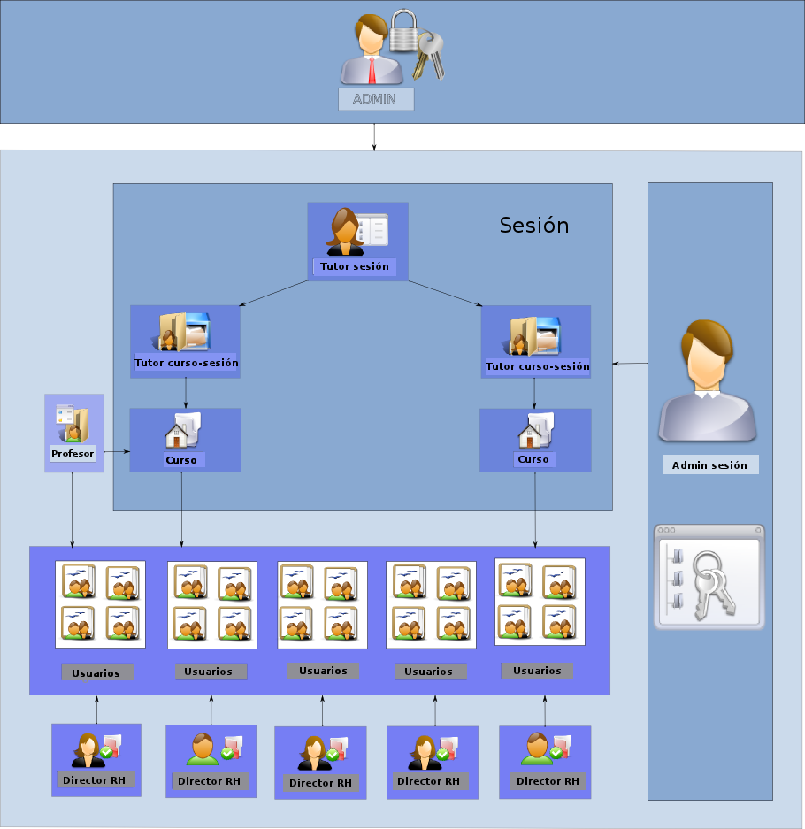
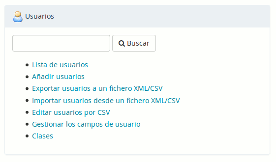
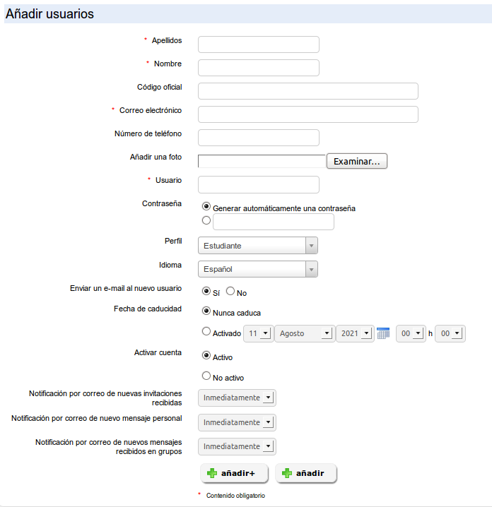
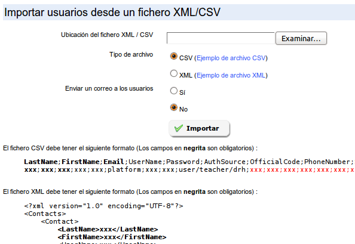
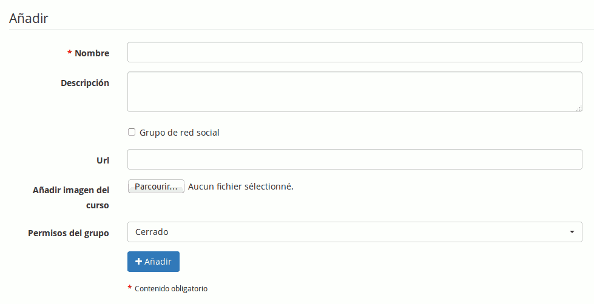
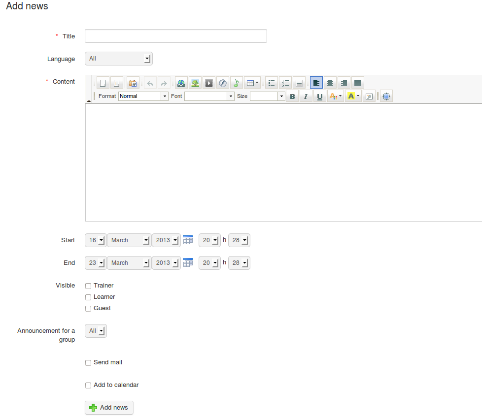
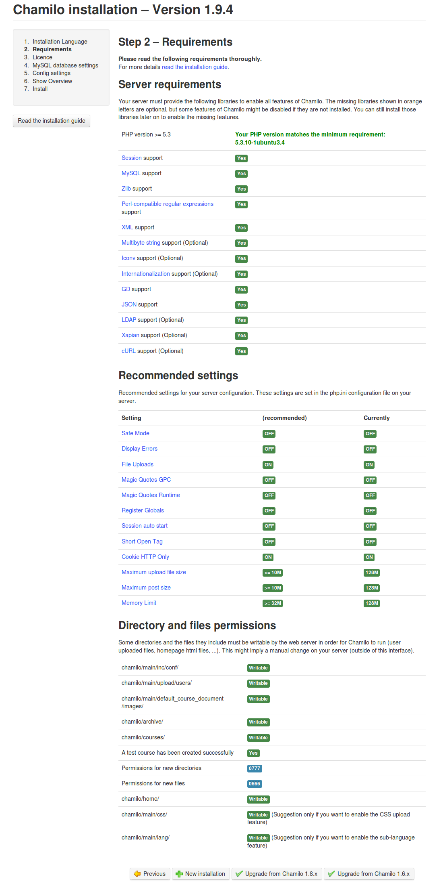

## Administración de Usuarios {#administraci-n-de-usuarios}

La gestión de usuarios se realiza a través de iconos genéricos y familiares.

| Iconos | Funcionalidades |
| --- | --- |
|  | Modifica el estado del usuario (activado/desactivado) |
|  | Muestra la lista de cursos en los que está inscrito el usuario |
|  | Conectar como ... permite a los administradores tomar la identidad de un usuario específico. Puede ser útil para revisar un fallo que éste haya comunicado que le ocurre en la plataforma. También puede facilitar la realización de una rápida demostración de los diversos roles de usuario. |
|  | Asigna cursos a administradores o supervisores para su seguimiento (a través del Panel de control) |
|  | Asigna sesiones del curso a administradores o supervisores para su seguimiento (a través del Panel de control). |
|  | Suministra toda la información sobre el usuario, su lista de sesiones, la lista de cursos y otros detalles, además de muchas maneras de ampliarla. |
|  | Asigna usuarios a administradores o supervisores para el seguimiento (a través del Panel de control) |
|  | Da una información detallada sobre el usuario (deshabilitado para docentes y administradores) |
|  | Actualiza la información y ajustes de los usuarios |
|  | Muestra el calendario libre/ocupado de los usuarios |
|  | Elimina un usuario (después de la aprobación) |
|  | Muestra si un usuario es administrador o no. Sólo los administradores de cuentas (o los administradores de cuentas de sesiones) tienen una estrella amarilla, el resto aparece con una estrella gris. |

Tableau 1: Administración – Iconos de administración de usuarios

### Roles de los usuarios {#roles-de-los-usuarios}

Los roles de usuario son una parte fundamental en la gestión de los usuarios de un portal Chamilo, su profundo conocimiento le permite ir más allá de un uso privado, en una completa gestión académica en la que cada persona tiene su lugar y responsabilidad.

Para el administrador común, parecerá que sólo hay cuatro roles en Chamilo: los que aparecen directamente en el formulario de creación de usuarios en la sección de administración. Sin embargo, algunos roles en realidad ofrecen sub-roles, de los cuales sólo se puede adquirir conocimientos después de un uso más profundo de la plataforma.

Con el fin de guiarle en el descubrimiento de estos roles, se utilizará el siguiente esquema como referencia, ya que representa la mayor parte de las funciones y también la noción de sesiones (que veremos en el capítulo Capítulo 6 Administración de sesiones de la página 69).

Ilustración 43: Roles y sesiones

En este esquema, podemos ver al administrador principal (en la parte superior), al administrador de sesiones (a la derecha), al tutor de la sesión (en la parte superior del bloque de la sesión), a los tutores de los cursos (en la parte superior de los cursos), al docente (a la izquierda de un curso), a los alumnos (conectado a la sesión) y al gerente de recursos humanos (conectado a los alumnos).

Vamos a revisar estos roles desde los menos poderosos a los más poderosos.

#### Alumno {#alumno}

| Descripción | El rol de alumno o alumno es el típico de la persona que sigue uno o varios cursos. Tiene acceso a los contenidos de los cursos en los que está inscrito. |
| --- | --- |
| Permisos en el curso | Por defecto, puede: |
| Permisos globales | Por defecto, puede: |

#### Asistente de curso {#asistente-de-curso}

| Descripción | Asistente de curso es un rol extendido del rol de alumno. Normalmente es un alumno al que el docente le encomienda la función de asistente en uno de sus cursos. Esto se realiza mediante la edición del usuario en el listado que presenta la herramienta usuarios. |
| --- | --- |
| Permisos en el curso | Por defecto, puede: |
| Permisos globales | Por defecto, puede: |

#### Gerente de recursos humanos (Supervisor) {#gerente-de-recursos-humanos-supervisor}

| Descripción | El gerente de recursos humanos o supervisor es un rol que se determina cuando se crea este tipo de usuario. También puede determinarse para cualquier usuario a posteriori a través de la pantalla de edición de usuario, pero esto podría afectar a otros permisos utilizados hasta entonces. |
| --- | --- |
| Permisos en el curso | Por defecto, puede: |
| Permisos globales | Por defecto, puede: |

#### Tutor de curso {#tutor-de-curso}

| Descripción | El rol de tutor de curso es un docente que imparte un curso sobre la base de un contenido genérico que otros han preparado para él. Este contenido podrá ampliarlo con aportaciones propias. |
| --- | --- |
| Permisos en el curso | Por defecto, puede: |
| Permisos globales | Por defecto, puede: |

#### Tutor de sesión {#tutor-de-sesi-n}

| Descripción | El tutor de sesión es un docente que tiene la función de coordinar una sesión. Se comunicará con los tutores de curso de esa sesión. Podrá navegar por todos los cursos de la sesión, con el fin de observar los resultados de los usuarios y poder tomar las decisiones más adecuadas. |
| --- | --- |
| Permisos en el curso | Por defecto, puede: |
| Permisos globales | Los mismos que un tutor de curso |

#### docente {#docente}

| Descripción | El docente es el creador de cursos por excelencia. Crea los contenidos que se utilizarán directamente en un curso si no se usan sesiones o bien en todos los cursos de una sesión. |
| --- | --- |
| Permisos en el curso | Por defecto, puede: |
| Permisos globales | Por defecto, puede: |

#### Administrador de sesiones {#administrador-de-sesiones}

| Descripción | Administrador de sesiones es un rol exclusivo, es decir, no se puede combinar con ninguna otra función. Se determina durante la creación del usuario o mediante su edición posterior en la interfaz de administración. La persona que desempeña este rol se encarga de la gestión académica de las sesiones de los cursos, estableciendo quién va ocuparse de la docencia, en qué momento y a qué alumnos. |
| --- | --- |
| Permisos en el curso | Los mismos permisos que un tutor de sesión |
| Permisos globales | Por defecto, puede: |

#### Administrador de portal {#administrador-de-portal}

| Descripción | El rol de administrador de portal sólo tiene sentido si se utiliza el modo multi-url (ver 8.1Multi-URL de la página 87). A diferencia de un administrador global, un administrador de portal no podrá modificar todos los portales instalados. |
| --- | --- |
| Permisos en el curso | Todos los permisos |
| Permisos globales | Por defecto, puede: |

#### Administrador global {#administrador-global}

| Descripción | El administrador global es el usuario que tiene todos los permisos. Tiene acceso a todas las interfaces |
| --- | --- |
| Permisos en el curso | Por defecto, puede: |
| Permisos globales | Por defecto, puede: |

#### Usuario invitado {#usuario-invitado}

| Descripción | El usuario invitado es un usuario registrado en la plataforma y en un curso (o más), que puede navegar en los cursos pero que no deja huellas (no se registra la información de que estuvo ahí). Por lo general, funciona como un alumno intangible. |
| --- | --- |
| Permisos en un curso | Como el alumno normal, pero no deja huellas. |
| Permisos globales | Como el alumno. |

#### Superior de alumno {#superior-de-alumno}

| Descripción | El superior del alumno es similar, en la mayoría de los aspectos, al director de recursos humanos, pero según el uso de ciertos plugins, como el de suscripciones avanzadas, puede tener otras responsabilidades, como la de aprobar la suscripción a ciertos cursos de parte de los alumnos para los cuales el es el superior. |
| --- | --- |
| Permisos en un curso | Similares a DRH |
| Permisos globales | Similares a DRH |

#### Caso especial: usuario anónimo {#caso-especial-usuario-an-nimo}

| Descripción | El rol de usuario anónimo es un caso muy particular: sólo existe cuando no se posee una cuenta en la plataforma. Gracias a este mecanismo, el usuario anónimo puede hacer la mayoría de las operaciones que un alumno en los cursos que se configuren como públicos. |
| --- | --- |
| Permisos en un curso público | Por defecto, puede: |
| Permisos globales | Por defecto, puede: |

### Bloque usuarios {#bloque-usuarios}

En la página de administración, el bloque de usuarios se presenta de esta manera

### Lista de usuarios {#lista-de-usuarios}

Aquí el administrador puede gestionar a todos los usuarios con un simple clic sobre un icono.

Ilustración 45: Administración - Lista de usuarios

Con el fin de visualizar la lista de usuarios de una manera más clara, aquí hay una lista reducida de los roles y tipos de opciones a los que el administrador tiene acceso.

Ilustración 46: Administración - Usuarios - Opciones por rol

#### Estudiante/Alumno {#estudiante-alumno}

*   **Activo/Inactivo**: un alumno puede estar activado o desactivado

*   **Lista de cursos**: un alumno puede estar inscrito en varios cursos

*   **Iniciar sesión como:** permite realizar un _login_ como si lo hiciera ese alumno.

*   **Estadísticas:** permite el seguimiento del alumno (es el único tipo de rol con este tipo de seguimiento)

*   **Edición**: permite editar la cuenta del alumno

*   **Administración**: un alumno no puede ser administrador de la plataforma

*   **Calendario libre/ocupado**: muestra la disponibilidad del alumno

*   **Eliminar**: permite eliminar la cuenta del alumno

#### docente {#docente-0}

*   **Activo/Inactivo**: un docente puede estar activado o desactivado

*   **Lista de cursos**: un docente puede estar inscrito en varios cursos

*   **Iniciar sesión como:** permite realizar un _login_ como si lo hiciera ese docente.

*   **Estadísticas**: están deshabilitadas pues no se puede realizar el seguimiento de un docente más que a través del panel de control

    **Edición**: permite editar la cuenta del docente

*   **Administración**: si el icono está en gris, el docente no es administrador de la plataforma

*   **Calendario libre/ocupado**: muestra la disponibilidad del docente

*   **Eliminar**: permite eliminar la cuenta del docente

#### Administrador {#administrador}

*   **Activo/Inactivo**: siempre activo, pues un administrador no puede ser desactivado

*   **Lista de cursos**: un administrador puede estar inscrito en varios cursos

*   **Iniciar sesión como:** no es posible realizar un _login_ simulando que lo hace el usuario si éste es un administrador

    **Estadísticas**: están deshabilitadas pues no se puede realizar el seguimiento de un administrador más que a través del panel de control

    **Edición**: la cuenta de administrador no se puede editar, solamente lo puede hacer él mismo

*   **Administración**: si este usuario es administrador la estrella se mostrará en amarillo

*   **Asignar usuarios**: el rol administrador permite asignar usuarios a un curso

*   **Asignar cursos**: el rol de administrador permite asignar cursos

*   **Asignar sesiones**: el rol de administrador permite asignar sesiones

*   **Calendario libre/ocupado**: muestra la disponibilidad del administrador

#### Anónimo {#an-nimo}

El usuario anónimo es un caso particular, que sólo sirve al propósito de permitir que los usuarios no suscritos puedan beneficiarse libremente de los cursos puestos a disposición del público. El número de seguimiento de las oportunidades de este modo es reducido. Tenga en cuenta que si un curso no se ha configurado como público, esta cuenta de usuario anónimo es inútil y puede ser desactivada (aunque esta característica no está soportada oficialmente).

*   **Activo/Inactivo**: el usuario anónimo puede estar activado o desactivado

    **Lista de cursos**: el usuario anónimo no puede estar suscrito a los cursos

    **Iniciar sesión como:** está desactivado para el usuario anónimo

    **Estadísticas**: las estadísticas del usuario anónimo no se muestran

    **Edición**: el usuario anónimo no puede ser editado

*   **Administración**: el usuario anónimo no puede ser un administrador

*   **Calendario libre/ocupado**: el usuario anónimo no tiene un calendario libre/ocupado

    **Eliminar**: la cuenta de usuario anónimo no se puede eliminar, de otro modo se podrían producir incoherencias en el sistema.

Además de estas opciones de gestión, es posible eliminar todos o una parte de los usuarios, mediante la selección de la casilla a la izquierda del usuario y haciendo clic en “eliminar de la plataforma” situado debajo de la lista, en un proceso semejante a la gestión de los usuarios de un curso por un docente.

### Agregar usuarios {#agregar-usuarios}

Para agregar usuarios, el administrador deberá cumplimentar un formulario en el que obligatoriamente deberán figurar los siguientes datos:

*   &quot; Nombre &quot;

*   &quot;Apellido &quot;

*   &quot; correo &quot;

*   &quot; usuario &quot;

Además, hay otras opciones avanzadas a las que se debe prestar atención.

Ilustración 47: Administración - Creación de usuarios

La contraseña, se puede generar automáticamente o ser asignada por el administrador. Dependiendo de las necesidades de la situación, no se olvide de la opción &quot;Enviar un e-mail al nuevo usuario&quot;.

Seleccionar de forma correcta el rol del usuario es muy importante. Para más información, ver el capítulo 4.1Roles de los usuarios en la página 47.

La cuenta de usuario puede tener una fecha de caducidad. En este caso, uno tiene que elegir el final del periodo de suscripción.

Por último, la cuenta de usuario se pueden crear activos o inactivos, a la espera, por ejemplo, del inicio de una nueva sesión.

Tres nuevos campos se han añadido a Chamilo 1.8.8\. Estos campos le permiten configurar la frecuencia con la que los mensajes personales enviados desde la red social de Chamilo a su cuenta le serán enviados por e-mail. Si el usuario elige No, entonces el mensaje no será enviado a su correo electrónico para notificarlo. Esta opción requiere la configuración del lanzamiento de un script cronológico (_cron_).

### Exportar una lista de usuarios a un fichero XML/CSV {#exportar-una-lista-de-usuarios-a-un-fichero-xml-csv}

En Chamilo, es posible exportar todos o una selección de usuarios.

Ilustración 48: Administración - Exportar usuarios

Usted puede elegir entre dos formatos para el archivo de salida: [XML](http://fr.wikipedia.org/wiki/Extensible_Markup_Language) o [CSV](http://fr.wikipedia.org/wiki/Comma-separated_values). La mayoría de usuarios utilizan CSV que puede ser leído con facilidad por varios programas como MS-Excel® y OpenOffice.org Calc®.

Una elegido el formato, se recomienda marcar la casilla “_Sí, agregar el encabezado CSV”_. Entonces podrá escoger una lista limitada de usuarios a exportar (por curso) o dejarlo como está para exportar a todos los usuarios de la plataforma. Haga clic en _Exportar_ para iniciar la exportación.

Se abrirá una nueva ventana que le permite decidir qué hacer con el archivo.

### Importar una lista de usuarios desde XML/CSV {#importar-una-lista-de-usuarios-desde-xml-csv}

Si usted ha exportado una lista de usuarios, es posible que desee en algún momento también desee importar usuarios a la plataforma ...

Chamilo le permite importar los usuarios utilizando el mismo formato en el que se han exportado. A modo de ejemplo, dispone de dos archivos de prueba que puede descargar haciendo clic en el enlace (texto azul de la siguiente captura de pantalla). Si desea importar usuarios desde una fuente externa, el formato CSV es generalmente una opción fácil ya que se pueden generar con una herramienta simple de hoja de cálculo.

Para importar un archivo CSV/XML, realice los siguientes pasos:

Ilustración 49: Administración - Importar usuarios

*   seleccione el archivo tras pulsar Examinar

*   elija el formato de archivo (CSV o XML)

*   elija si desea enviar un mensaje de bienvenida a los nuevos usuarios registrados a través de esta importación

*   haga clic en Importar

Ilustración 50: Administración – Informe de la importación de usuarios

El mensaje de aviso muestra las incidencias que se produzcan y la lista de usuarios que no pudieron ser importados.

### Editar usuarios por CSV {#editar-usuarios-por-csv}

En ciertos casos, por ejemplo si tiene otro sistema de gestión y no ha desarrollado (o hecho desarrollar por un proveedor oficial[^10]) un sistema de sincronización, puede tener la necesidad de modificar los datos de muchos alumnos. Que dolor sería hacerlo a mano, alumno por alumno.

En este caso, la funcionalidad de editar usuarios por CSV le permite, reusando el nombre de usuario como clave, “reimportar” los usuarios con sus datos actualizados a través de un archivo CSV.

### Clases {#clases}

A partir de la versión 1.10, se han unido las nociones de clases y de grupos en la red social. Esto se puede visualizar tanto dentro de la herramienta de usuarios de un curso, como dentro de la página de administración, donde la entrada “Grupos sociales” ha sido remplazada por “Clases” y la entrada “Clases” (que solía encontrarse en el bloque de sesiones de formación en la versión 1.9, y ser mutuamente exclusiva con la de sesiones en la versión 1.8) ha sido eliminada.

La diferencia entre clase y grupo es que, al crear una clase, ahora, tendrá la opción de marcar “Grupo de red social”, lo cual habilitará un espacio de grupo en la red social para esta clase.

Con este cambio, es posible ahora armar un grupo de red social que pueda ser inscrito de un solo golpe a un curso (usando la noción de clase). De la misma manera, ahora una clase podrá tener un espacio neutro (en la red social) en el cual conversar entre alumnos.

#### Grupo de red social {#grupo-de-red-social}

La herramienta de _red social_ permite crear grupos de interés común donde los usuarios dialogan de forma similar a la de un foro. Los grupos que usted cree podrán ser abiertos o cerrados. Con otras opciones de configuración, también puede decidir si se va a permitir que los usuarios puedan crear sus propios grupos de interés.

Ilustración 51: Administración - Creación de grupos sociales

Para que esta clase sea un grupo en la red social, marque la casilla “Grupo de red social”.

### Lista de grupos {#lista-de-grupos}

En esta sección puede actualizar o eliminar los grupos, así como agregar usuarios a un grupo.

Ilustración 52: Administración - Lista de clases

Si usted hace clic en el enlace del nombre del grupo se le conducirá a la página de ese grupo y a la pestaña de _redes sociales_.

Se puede visualizar en la parte derecha una columna “Tipo” que tiene como valores “Clase” o “Social”, para diferenciarlos.

Como se puede observar en la captura, es posible también importar y exportar las listas de grupos en formato CSV.

### Gestionar los campos de usuarios {#gestionar-los-campos-de-usuarios}

Esta herramienta le permite añadir extensiones al perfil de todos los usuarios. Cada campo creado a través de esta herramienta tiene varias opciones de configuración:

*   _Visibilidad,_ le permite decidir si el nuevo campo debe aparecer en la página del perfil extendido del usuario. Esto supondrá que éste lo pueda ver.

*   _Modificable,_ le permite decidir si el contenido de este campo puede ser modificado por el propio usuario o si se mantendrá el valor específico que le asigne el administrador para todos los usuarios.

*   _Filtro,_ le permite decidir si el campo puede ser utilizado como un filtro y si su contenido se puede exportar cuando se realice una exportación de los ejercicios

Se pueden crear campos en el perfil de un usuario sin que éste tenga que tener conocimiento de su existencia, pues tendrán como fin mejorar su organización administrativa o permitir la sincronización con otros sistemas (por ejemplo, mediante un identificador único común). Por otro lado, hay otro tipo de campos adicionales que sí deberían ser visibles al usuario y quizá también modificables, como su fecha de nacimiento, país, lengua materna, etc. Esta información permitirá generar mejores estadísticas en función de la edad, cultura, conocimientos previos, etc

Para usuarios familiarizados con Drupal esto es equivalente a un mini modulo CCK en Chamilo.

Ilustración 53: Administración - Lista de campos del perfil de usuario

| Iconos | Funcionalidades |
| --- | --- |
|  | Editar / Eliminar campo |
|  | Hacer modificable / No modificable |
|  | Organización de los campos |
|  | Mostrar / Ocultar un campo del usuario |

Tabla 2: Administración – Iconos de administración de los campos del perfil

[^10]: https://chamilo.org/en/providers