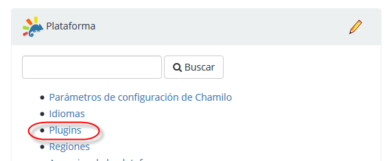
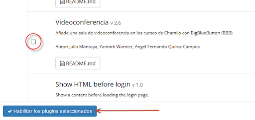
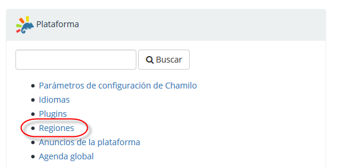
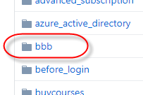
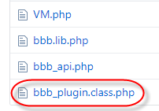
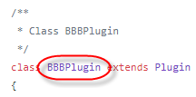

# Desarrollo de plugin para chamilo

## Descripción:

Un plugin de Chamilo es una extensión de código de programación de forma que se puede añadir una funcionalidad a la plataforma sin la necesidad de modificar el núcleo (core) de la aplicación principal

Usando la definición de wikipedia sería: "_En informática, un **complemento** o «**plug-in**» es una aplicación (o programa informático) que se relaciona con otra para agregarle una función nueva y generalmente muy específica. Esta aplicación adicional es ejecutada por la aplicación principal e interactúan por medio de la interfaz de programación de aplicaciones._"

Partiendo de dicha premisa, para desarrollar un plugin de Chamilo se debe cumplir: 
* añadir nueva funcionalidad a la plataforma
* integración con la interfaz usando la API disponible
* el código base de Chamilo no sea alterado.


## Estructura:

Los plugins de Chamilo están ubicados en la carpeta plugin en el primer nivel de directorios donde esté instalada la plataforma.

Chamilo trae por defecto plugin integrados que permanecen deshabilitados por defecto, al entrar en la carpeta plugin los podremos ver separados en distintas carpetas con un nombre específico.

El nombre de la carpeta del plugin se recomienda que tenga relación con la función que se desee realizar y si tenemos claro que se va a definir una clase PHP en la implementación del proyecto pues utilizar el nombre de la clase PHP en minúsculas y sin el sufijo "Plugin" al final.

Si hacemos un breve recorrido por los distintos directorios de los plugins observamos dos tipos de estructuras:


*   **Plugins con estructura básica:** los ficheros se encuentran en la raíz de la carpeta principal (Ejemplo: "hello_world", "redirection", "before_login", "courseblock")
*   **Plugins con estructura en directorios**: principalmente se usan clases y se estructuran en carpetas (Ejemplos: "bbb", "buycourses", "sepe", "google_maps")
*   Directorios comunes:
    *   **lang**: ficheros de idioma
    *   **resources**: ficheros de estilos, imágenes
    *   **src o lib**: ficheros de clases, librerías de funciones
    *   **view**: ficheros de plantillas

Por último indicar que en el directorio /main/inc/lib podremos encontrar la mayoría de las clases de Chamilo que deberemos usar para obtener información relativa de la plataforma, curso, sesiones, usuarios, etc...


## Activar/Desactivar plugins en Chamilo

Para activar un plugin deberá entrar en la sección de "Plugins" desde la administración: 



Seleccionar el checkbox del plugin que se desee activar y posteriormente pulsar sobre el botón "Habilitar los plugins seleccionados":



El proceso para desactivar el plugin es similar al de activación simplemente habrá que deseleccionar el plugin activo y pulsar sobre el botón de "Habilitar los plugins seleccionados"

## Regiones:

Es importante conocer o tener una idea de donde se van a mostrar los resultados de plugin (ojo! no siempre será esto así pues puede que la funciones que realice el plugin sean internas y no muestre resultado en pantalla).

En el fichero /main/inc/lib/plugin.lib.php se puede observar las distintas regiones creadas para los plugins:

*   **Plataforma**: zonas de la pantalla en cualquier parte de la plataforma
    *   `'main_top'- parte superior de la pantalla`
    *   `'main_bottom' - parte inferior de la pantalla`
    *   `'login_top'- parte superior del login`
    *   `'login_bottom'- parte inferior del login`
    *   `'menu_top'- parte superior del módulo de menú lateral`
    *   `'menu_bottom'- parte inferior del módulo de menú lateral`
    *   `'content_top'- parte superior del contenido principal`
    *   `'content_bottom'- parte inferior del contenido principal`
    *   `'header_main' - cabecera`
    *   `'header_center' - cabecera centrado`
    *   `'header_left' - cabecera a la izquierda`
    *   `'header_right' - cabecera a la derecha`
    *   `'pre_footer' - Antes del pié de página`
    *   `'footer_left' - En el pié de página en la izquierda`
    *   `'footer_center' - En el pié de página centrado`
    *   `'footer_right' - En el pié de página en la derecha`


*   **Administración**: sólo será visible por los administradores dentro de la administración en la que aparecerá un enlace al plugin:
    *   'menu_administrator' -> usar **admin.php** como punto de entrada al plugin


*   **Curso**: como si se tratara de una herramienta más dentro del curso:
    * 'course_tool_plugin' -> usar **start.php** como punto de entrada al plugin

Por defecto un plugin estará disponible para definir las regiones de la plataforma, pero si queremos que aparezca en la zona de administración o con las herramientas del curso habrá que especificar en la clase del plugin las siguientes variables respectivamente:
```
public $isAdminPlugin = true;
public $isCoursePlugin = true;
```

Para seleccionar la región de un plugin en Chamilo hay dos vías de acceso:
*   `Desde la administración acceder a "Regiones":`

    

*   `Desde la pantalla de "Plugins" pulsando en el botón "Regiones" de los plugins que se encuentren activos":`

    

*   Desde la pantalla de "Regiones" se selecciona la zona deseada donde mostrar el plugins.

Existe un plugin en la plataforma llamado "show_regions" que permite al administrador visualizar las distintas regiones en la plataforma. 

## Análisis:

#### Fichero index.php

Punto de entrada al plugin, excepto en los plugins donde se haya definido en la clase la variables:

```
public $isAdminPlugin = true; → El archivo principal será admin.php
public $isCoursePlugin = true; → El archivo principal será start.php
```

#### Fichero plugin.php

Información del plugin, este fichero es necesario. Hay dos formas en la que se puede implementar:

*  Usar el array $plugin_info y completar la información:
```
$plugin_info['title'] = 'Nombre legible del plugin';
$plugin_info['comment'] = "Comentario breve de lo que hace el plugin";
$plugin_info['version'] = '1.0'; // o la versión que corresponda
$plugin_info['author'] = 'Autor o autores que hayan participado en el desarrollo';
```

*  Si ha definido una clase Plugin se puede usar el método **get_info:**
```
require_once __DIR__.'/config.php';
$plugin_info = <Nombre>Plugin::create()->get_info();
```
*Sustituir <Nombre> por el nombre que corresponda de la clase definida*

#### Fichero config.php

Archivo opcional, usado para incluir las librerías, definiciones, etc..
Ejemplo:
```
require_once __DIR__.'/../../main/inc/global.inc.php';
```

#### Fichero README.md

Descripción del plugin, puede ser lo extensa que se desee. 
Se puede añadir información de casos de uso y peculiaridades que sean oportunas.

##### Definir la clase del plugin

Tener en cuenta el nombre que se elige al plugin, será utilizado en la carpeta del plugin, en el fichero de la clase y en el nombre de la clase. Ejemplo:





**Nombre de la clase:**
```
class <nombre>Plugin extends Plugin
```
*donde <nombre> será sustituido por el nombre elegido para el plugin.*

**Definición de constantes: (opcional)**
```
    const <NOMBRE_CONSTANTE> = <valor>;
    <NOMBRE_CONSTANTE> → Nombre de la variable en mayusculas.
```
*valor → Cadena de texto o valor numérico.*

**Variables del plugin: (opcional)**

``` [php]
public $isAdminPlugin = true; //Enlace en administración de acceso al plugin
public $isCoursePlugin = true; → Herramienta de los cursos
```
Si usamos **$isCoursePlugin = true** podemos definir variables específicas para cada curso de la siguiente manera:
``` [php]
public $course_settings = [
    [
        'name' => '<nombre_variable>',
        'type' => '<tipo_variable>',
    ],
    //…(se puede indicar desde 1 variable hasta las que se desee)
];
```
*<nombre_variable> → Nombre de la variable*
*<tipo_variable> → Tipo de variable, puede ser 'checkbox', 'text', 'select' (esta última deberá contener un array de opciones 'options')*

**Constructor:**

```
protected function __construct()
{
    parent::__construct(
        '<version>',
        '<autor',
        ['nombre_variable' => '<tipo>']
    );
}
```
*version → Versión de desarrollo del plugin.*
*autor → Nombre del autor o autores que participan en el desarrollo.*
*nombre_variable → array de variables de configuración, son opcionales.*
*tipo → Tipo de variable, puede ser 'checkbox', 'text', 'select' (esta última deberá contener un array de opciones 'options')*

**Función create:**

```
    public static function create()
    {
        static $result = null;
        return $result ? $result : $result = new self();
    }
```

**Función install:**
Si nuestro plugin requiere que se realice tareas previas ya sea de consulta o de creación de tablas de bases de datos con las que interaccionar tendremos que crearlas en el proceso de instalación.

```
 public function install()
{
    // <Aquí realizaremos las tareas que sean oportunas>
    // Crear tablas de bases de datos
    // Copiar ficheros de un directorio a otro
    //etc...

    $this->install_course_fields_in_all_courses(); // Usaremos esta variable si el plugin está definido como herramienta del curso
}
```

Para llamar a la función install se creará en la raíz del plugin un fichero llamado install.php con la siguiente llamada:

```
    require_once __DIR__.'/config.php';
    <Nombre>Plugin::create()->install();
```
*Sustituir <Nombre> por el nombre que corresponda de la clase definida*

**Función uninstall:**
Similar a la función install pero para desinstalar o deshacer cambios. 

```
public function uninstall()
{
    <Tareas a realizar>
}
```

Para llamar a la función uninstall se creará en la raíz del plugin un fichero llamado uninstall.php con la siguiente llamada:

```
require_once __DIR__.'/config.php';
<Nombre>Plugin::create()->uninstall();
```
*Sustituir <Nombre> por el nombre que corresponda de la clase definida*

#### Uso de las variable definidas en el plugin

```
// Instancia de la clase
$plugin = <Nombre>Plugin::create();

// Obtener el valor de una variable de la clase
$setting = $plugin->get("variable");
$setting = api_get_setting('PREFIJO-PLUGIN_variable');
$setting = $plugin->settings['PREFIJO-PLUGIN_variable'];

// Obtener el valor de una cadena de idioma
$plugin->get_lang("CadenaParaTraducir");
```

## Recomendaciones:

*   Usar código de otros plugin a modo de ejemplos
*   Usar código ordenado y formateado: 
    consultar [https://github.com/chamilo/chamilo-lms/wiki/Coding-conventions](https://github.com/chamilo/chamilo-lms/wiki/Coding-conventions)
*   Consultar la wiki [https://github.com/chamilo/chamilo-lms/wiki](https://github.com/chamilo/chamilo-lms/wiki)