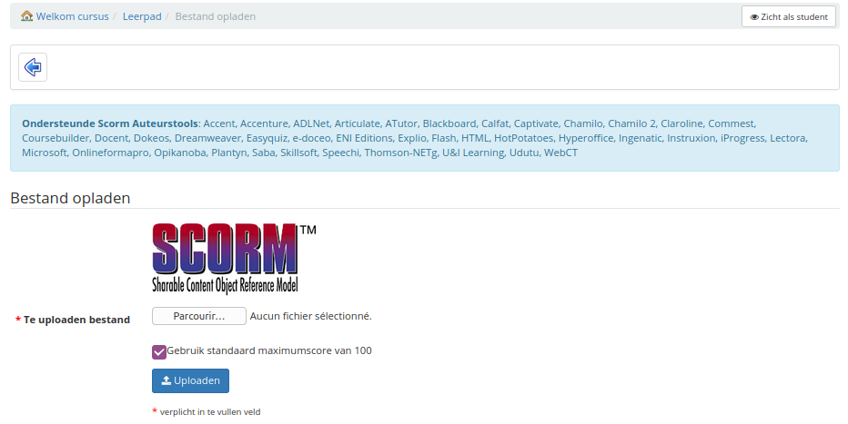

# Récupération de sauvegardes

## Les parcours 

Après avoir exporté des parcours, il est utile de savoir comment les réimporter dans une autre installation de Chamilo.

Dans l'onglet « Mes cours », créer un cours vide correspondant à celui qui doit être importé, si celui-ci n'existe pas. Une fois dans le cours, cliquer sur « Parcours ».

Dans le parcours, il y a trois possibilités \(la dernière dépend de votre activation ou non du service _Chamilo Rapid –_ voir le chapitre 5.3Chamilo Rapid Course \(conversion ppt\) en page 88\) :

* « Créer un parcours » \(première icône\),
* « Import [AICC](http://fr.wikipedia.org/wiki/Aviation_Industry_CBT_Committee) et [SCORM](http://fr.wikipedia.org/wiki/Sharable_Content_Object_Reference_Model) » \(seconde icône\),
* « Conversion PowerPoint » \(troisième icône\)

Illustration : Interface - Import de parcours

Pour importer le parcours précédemment exporté, cliquez sur « Import AICC et SCORM » \(seconde icône\).

Illustration : Interface - Import de parcours SCORM

Évidemment, la sauvegarde à importer doit être compatible avec les formats SCORM ou AICC.

## Les cours 

Il existe deux façons d'importer un cours à partir de Chamilo:

* importer un fichier depuis son ordinateur,
* utiliser un fichier de sauvegarde qui se trouve sur le serveur \(dans le dossier « chamilo/app/cache »\)

## La réintégration complète 

La réintégration complète est nécessaire en cas d'effacement total des bases de données ou en cas de problèmes majeurs d'utilisation ou d'administration.

Il n'existe pas de fonctionnalité au sein de l'interface de Chamilo elle-même qui permette de procéder à une restauration complète des données \(question de protection contre les erreurs de manipulation\).

Néanmoins une réintégration a été testée en local après avoir sauvegardé toutes les bases de données du Chamilo par PhpMyAdmin et le dossier racine. La démarche est censée être la même avec un serveur distant et une connexion en SSH / sFTP ou par FTP.

En voici la procédure :

1. Copiez la sauvegarde du dossier racine faite au préalable, vers l'endroit où se trouve le chemin d'accès à l'outil \(par exemple dans local _/var/www_\). Garder la même structure de répertoire permet de ne pas perdre de chemins d'accès qui seraient utiles pour l'utilisation de certaines données.
2. Importer la sauvegarde de la base de données depuis PhpMyAdmin.
3. Se connecter au site et vérifier si tout est bien rétabli.

La sauvegarde contient les utilisateurs, leurs identifiants et leurs mots de passe associés, ainsi que les cours et les parcours correspondants.

