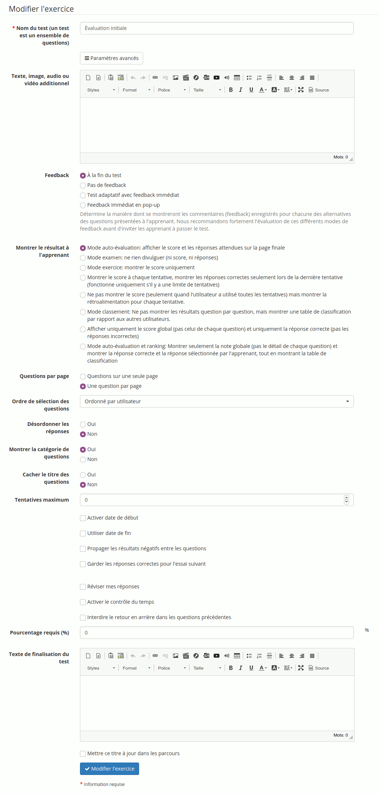

# Créer un Exercice

Cliquez sur « Nouveau test » et donnez-lui un nom. Vous pouvez en rester là et passer à la page suivante, mais ici nous vous demanderons d'étendre le formulaire en cliquant sur le bouton « Paramètres avancés ».

Illustration 40: Exercices - Création d'un test - Options avancées

Les autres paramètres sont facultatifs, mais ils permettent de préciser quelques conditions :

* l'icône « médias associés » permet d'associer un média \(texte, son, image, etc.\) à l'aide de l'éditeur interne, cette information apparaîtra au début du test,
* donner un « Feedback » ou non aux apprenants,
* le mode d'affichage des « Questions par page »,
* choisir de « Montrer le résultat \(du test\) à l'apprenant » ou non,
* définir si utiliser un « Ordre des questions aléatoire »,
* définir si mélanger \(ou non\) les réponses au sein des questions à choix multiple,
* permettre la catégorisation des questions en catégories différentes et leur sélection aléatoire **par catégorie** pour les examens,
* limiter le nombre des tentatives,
* limiter le test dans le temps permet de lui donner une date de début et une date butoir où il ne sera plus accessible,
* choisir de propager les scores négatifs d'une question à une autre, ou de définir le minimum pour une question comme étant « 0 »,
* « activer le contrôle du temps » permet d'afficher un compteur dégressif du temps restant durant l'exercice.
* définir si les apprenants pourront réviser leurs réponses avant de finaliser l'examen,
* définir un pourcentage limite considérer comme « succès » à l'examen,
* définir un message de fin d'exercice

Ensuite « Poursuivre avec la création de questions » pour ajouter la première question au test.

**Note** : _la combinaison de_ _**feedback immédiat**_ _avec le mode_ _**auto-évaluation**_ _donne accès à un type d'exercice adaptatif assez différent du reste, qui n'est pas couvert dans ce guide._

