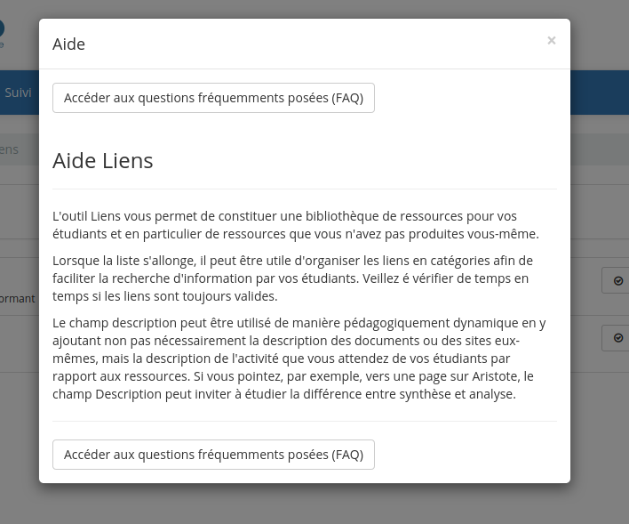
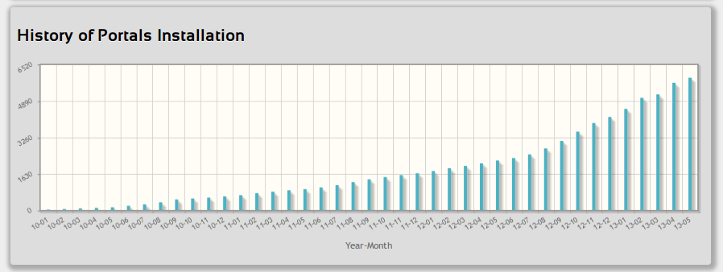

# Ergonomie générale

Chamilo a été créé pour fournir de l'aide au sein même de l'application. Les icônes ont été concue pour symboliser ce qu'elles représentent, indépendamment de la langue ou de la culture de l'utilisateur. Enfin, chaque icône offre une brève description de son fonctionnement qui s'affiche au moment de passer par-dessus avec le curseur de la souris \(sans cliquer\).

Il existe également un système d'aide en ligne sur une majorité des pages qui apparaît sous forme d'une bouée de sauvetage partiellement obfusquée dans la partie supérieure droite de l'écran \(voir Illustration 2: Aide cachée\) et qui se déplie au moment de passer par dessus avec le curseur de la souris \(voir Illustration 3: Aide dépliée\). L'aide se déplace selon la position de l'écran et reste toujours disponible. Vous pouvez l'ouvrir ou la fermer sans affecter votre travail du moment. Lorsque vous cliquez sur la bouée, un petit guide s'ouvre dans une fenêtre flottante, expliquant l'outil sur lequel vous êtes ainsi que la manière de l'utiliser \(voir Illustration 4: Fenêtre d'aide contextuelle\).

Illustration 2: Aide cachée

Illustration 3: Aide dépliée

Illustration 4: Fenêtre d'aide contextuelle

## Terminologie 

Chamilo est utilisé par de dizaines de milliers d'organisations dans le monde entier, en différentes langues, incluant des écoles d'enseignement primaire, collèges, instituts, universitaires, des ONG, des institutions gouvernementales, ainso que des petites, moyennes et grandes entreprises.

Illustration 5: Historique d'installations de Chamilo dans le monde de 2018 à 2020

Il est clair qu'elles tendent toutes à utiliser des terminologies différentes. Par exemple, quelques institutions appellent leurs cours “sessions de formation”. D'autres les appellent “espaces d'apprentissage”, d'autres les appellent simplement “cours”. Ceci suppose un défi pour élaborer une plateforme de formation de “taille unique” \(ou même un guide utilisateur\). C'est pourquoi nous avons recherché une solution intermédiaire et employé une terminologie simple et universelle que nous espérons avoir du sens pour tous nos utilisateurs. Chamilo compte déjà plusieurs dizaines de milliers de portails Chamilo installés dans le monde. Soit autant d'organisations, petites et grandes, qui totalisent plus de 25 millions d'utilisateurs dans le monde.

Nous comprenons bien entendu que votre organisation puisse préférer une terminologie spécifique. C'est pourquoi nous avons équipé Chamilo d'une fonctionnalité d'édition des termes d'interface depuis la section d'administration de la plateforme \(cela demande cependant des permissions d'administrateur, c'est pourquoi elle est décrite dans le Guide d'administration de Chamilo\). Si vous avez besoin d'une personnalisation d'urgence, vous pouvez toujours contacter les fournisseurs officiels de Chamilopour l'élaboration d'un paquet de langues personnalisée pour l'importer sur votre plateforme.

Dans ce guide, nous nous sommes efforcés à utiliser une terminologie universelle. Ainsi, par exemple, le terme « étudiant » employé communément a été remplacé par des termes plus neutres comme « apprenant » qui s'appliquent aussi au monde professionnel. Quand on se réfère à tous les types d'utilisateurs de manière collective, on utilisera le terme « utilisateur ».

Ainsi, nous avons aussi décidé d'utiliser le terme « enseignant » pour identifier les différents acteurs qui ont un rôle similaire mais pas identique : formateurs, tuteurs, professeurs, enseignants, etc \(et leurs équivalents féminins, évidemment\).

Ce manuel est disponible en différents formats. Vous pouvez le télécharger depuis notre site web en un format non-éditable. Pour un format éditable, envoyez-nous un petit courriel à info@chamilo.org. Si vous l'améliorez, nous nous ferons un plaisir d'intégrer vos changements au manuel de base.

L'unité de regroupement minimale des outils s'appelle un « cours ». Le terme « parcours d'apprentissage » utilisé dans les versions précédentes du logiciel a été réduit au terme « parcours » pour éviter des problèmes d'affichage.

Enfin, vous trouverez tous ces termes définis et expliqués dans ce guide. Si vous avez un doute, révisez leGlossaire en page196. N'oubliez pas que vous pouvez personnaliser ces termes avec l'aide de votre administrateur et de l'outil de sous-langages.

