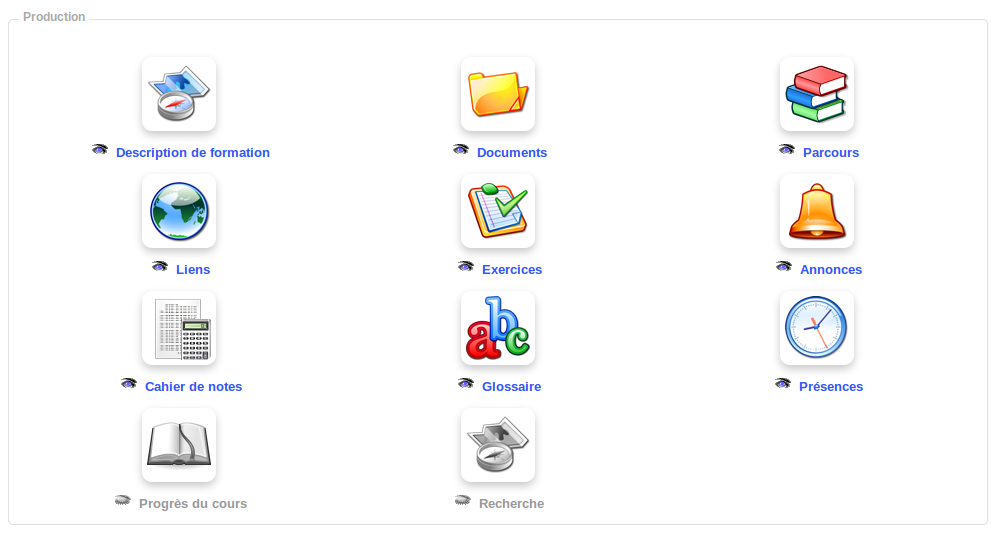

# Administrer un cours {#administrer-un-cours}

L'onglet « Mes cours » permet de visualiser les cours qui sont administrables par l'enseignant \(ils affichent une icône de crayon pour l'édition du côté droit de la boîte de chaque cours\).

Il suffit de cliquer sur le cours pour accéder à son interface. Trois catégories d'outils apparaissent :

* Production : permet de générer le contenu du cours,

* Interaction : regroupe des outils utiles à l'utilisation du cours,

* Administration : outils d'administration du cours, comme le suivi ou la sauvegarde.

Illustration 19: Outils de cours - vue classique

L'enseignant peut choisir de cacher ou de montrer différents outils grâce à l'œil qui est devant chaque outil, et ce afin de ne pas surcharger un cours par excès de possibilités.

Note : selon les cas, l'administrateur peut rendre disponible/indisponible les outils aux enseignants ou peut activer/désactiver certains outils qui dépendent d'extensions \(comme les outils de recherche et de vidéo-conférence\).

Illustration 20: Outils de production vue sur un iPad

**Note** : L'interface du cours peut se présenter de manière différente selon le choix de l'administrateur. Par exemple, il pourra activer une apparence plus moderne des dispositifs mobiles, comme dans cette illustration.

