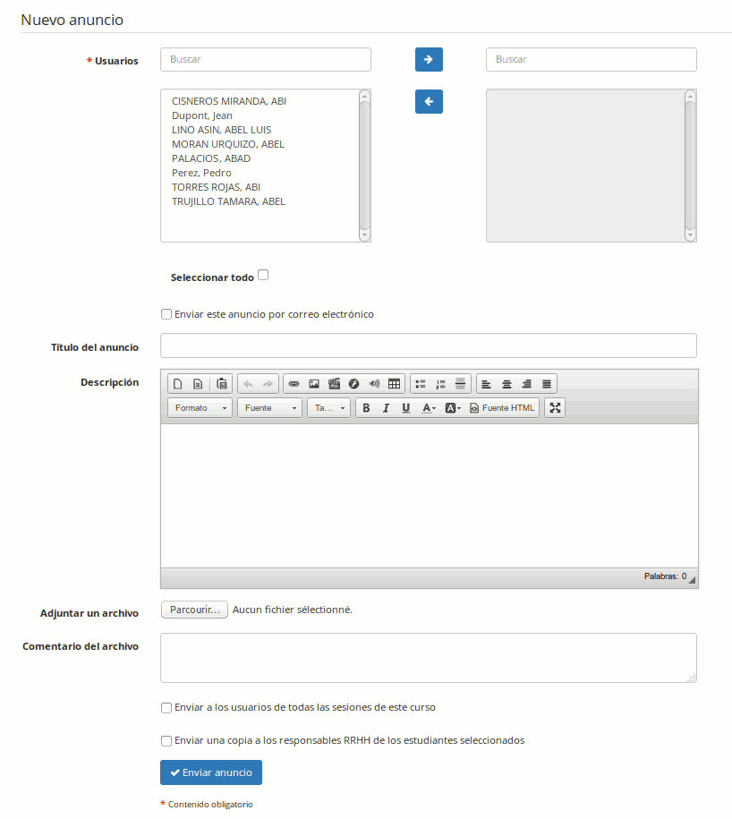

## Añadir un anuncio {#a-adir-un-anuncio}

Desde la página principal de Anuncios:

*   clic en el icono de _Añadir un anuncio_ ,

*Ilustración 137: Añadir un anuncio*

*   por defecto, el anuncio no se enviará a nadie. Es necesario seleccionar los usuarios de destino en la lista de la derecha en el enlace de _Dirigido a_ 

*   el anuncio puede ser enviado por e-mail a los usuarios del curso (marca la casilla de _Enviar este anuncio por correo electrónico),_

*   añade un asunto al anuncio,

*   escribe el cuerpo del mensaje usando el editor,

*   añade un adjunto si lo deseas,

*   haz clic en _Enviar anuncio_

Nota: desde la versión 1.8.8.4, puedes utilizar etiquetas dentro de tus anuncios (simplemente cópialas y pégalas). Estas etiquetas serán automáticamente reemplazadas por el correspondiente valor cuando el mensaje sea enviado por e-mail o mostrado en la plataforma a los usuarios.

Las etiquetas disponibles (al momento de publicar la versión 1.10) son:

- ((user_name)) que se sustituye por el nombre de usuario (login)

- ((user_firstname)) el nombre

- ((user_lastname)) el apellido

- ((teacher_name)) el nombre (completo) del profesor

- ((teacher_email)) el correo electrónico del profesor

- ((course_title)) el título del curso

- ((course_link)) un enlace HTTP hacia el curso (particularmente práctico en un correo)

- ((official_code)) el código oficial del alumno, si existe

*   Los anuncios aparecerán de la siguiente forma a los destinatarios en la plataforma:

    

    *Ilustración 138: Anuncios – Vista estudiante*
