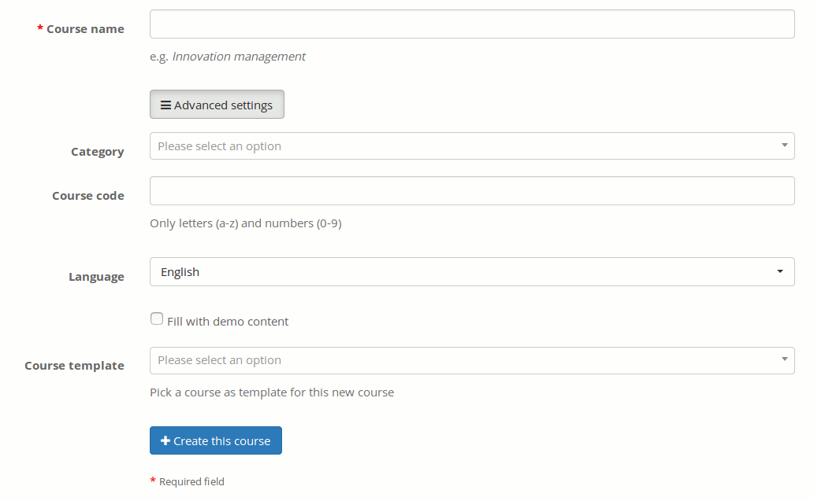

# Creación de cursos {#creaci-n-de-cursos}

Crear un curso es rápido y fácil, y puede hacerse desde la página de _Mis_ cursos

Ilustración 12: Bloques del menú de usuario

> **Nota :** en algunos portales, los profesores pueden no tener permisos para crear nuevos cursos y simplemente es el administrador quien les asigna cursos ya creados.

Dale clic en _Crear_ _un_ _curso._ Cumplimenta los campos obligatorios (ver Ilustración 13: Creando un curso – versión corta) y haz clic en el botón. Ya está.

El curso será visible para el creador del curso y (posteriormente) por los usuarios inscritos al mismo. Por defecto, la persona que crea el curso es responsable de la administración del mismo. Generalmente será denominado el **Propietario del curso** o el **Creador del curso.**

Para crear el curso, solo necesitas introducir un único dato, el título o nombre del curso.

*Ilustración 13: Creando un curso – versión corta*

Haciendo clic en el enlace de _parámetros avanzados_, se presentan opciones adicionales (totalmente opcionales):

*   _categoría,_ a elegir de un campo auto-completado[^5] (opcional),

*   código del curso Introduce un código que corresponda con el título del curso, por ejemplo mediante una clasificación numérica (ten en cuenta que aunque se introduzca en minúsculas, el código automáticamente será convertido a mayúsculas y los símbolos como _(, -, _ y espacios_ serán eliminados),

*   idioma utilizado para mostrar el entorno del curso (nada te impide usar por ejemplo Francés aunque la plataforma esté instalada en Inglés). La elección de idioma no influye en el contenido del curso, sólo en la interfaz.[^6]

*   opcionalmente el curso puede ser completado con algunos **contenidos demo** para orientar al nuevo administrador del curso sobre la clase de recursos que puede crear en el mismo (normalmente un ejercicio, foro y una sección de introducción). También puede ser creado completamente en blanco.

*Ilustración 14: Crear un curso – versión extendida*

La página siguiente que aparece en la creación del curso sugiere varias posibilidades:

*   ir directamente al recién creado curso (a través de un enlace con el título del mismo),

*   ir directamente, haciendo clic en el icono correspondiente, a uno de los pasos más frecuentes en la configuración del curso:

*Ilustración 15: Creación del curso – continuación*

Con la estructura vacía ya creada, el siguiente paso es enriquecer el curso con la adición de texto, documentos multimedia, pistas de audio, enlaces, etc.

[^5]: Solo el administrador puede volver a definir las categorías de cursos. Por defecto son PC Skills, Projects y Language skills

[^6]: Con una excepción: si el contenido demo está disponible, este contenido es creado en el idioma del curso. Modificar el idioma del curso después, puede ocasionar que la interfaz aparezca en un idioma y el contenido en otro.