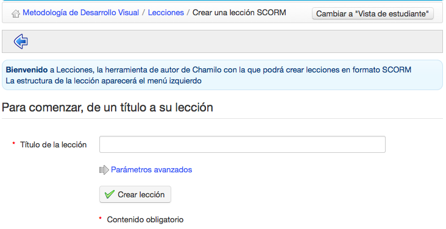
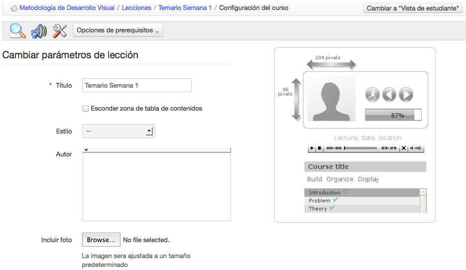

## Crear una rutas de aprendizaje {#crear-una-rutas-de-aprendizaje}

_Haz clic en el icono de crear un nuevo curso_[^]_:___

Ilustración 89: Rutas de aprendizaje – Crear una nueva rutas de aprendizaje

Dale un nombre a tu rutas de aprendizaje y pulsa en el botón _Continuar._ La rutas de aprendizaje se crea inmediatamente (sin contenido, de momento). Aparecerá en la lista de rutas de aprendizaje. Una vez la rutas de aprendizaje es creada, tienes acceso a una serie de herramientas para:

*   actualizar la configuración de las rutas de aprendizaje 

*   añadir y ordenar elementos mientras construyes tu rutas de aprendizaje 

*   añadir una actividad / objeto / documento 

*   añadir una nueva sección 

*   usar una pantalla de vista previa para comprobar cómo se va a mostrar a los alumnos 

Ilustración 90: Ruta de aprendizaje – Añadir un objeto o una actividad

### Configuración de la ruta de aprendizaje {#configuraci-n-de-la-ruta-de-aprendizaje}

Haciendo clic en el icono de configuración  se abrirá la página de configuración. La imagen de ejemplo de la derecha del formulario representa lo que será visto por el alumno al utilizar la ruta de aprendizaje, en función de las opciones configuradas en el formulario.

Ilustración 91: Ruta de aprendizaje – Configuración

[^]: Tenga en cuenta que Chamilo usa el término simple &quot;curso&quot; aquí en lugar de &quot; rutas de aprendizaje&quot;. No hay que confundir esto con el término &quot;curso&quot; en su aplicación al curso general (Metodología de Desarrollo Visual en la ilustración)