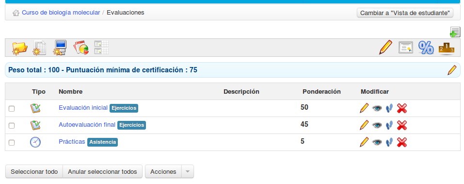

# Evaluaciones {#evaluaciones}

La herramienta _Evaluaciones_es una donde tu, como profesor, puedes establecer los criterios de evaluación para el curso ( por ejemplo la nota de corte, las calificaciones, etc) que implica la asignación de ponderaciones para las distintas actividades, tests, etc. Puedes utilizar la herramienta de evaluaciones para generar y emitir certificados para los alumnos que han finalizado el curso con éxito y, desde la versión 1.9, puedes vincular (en caso hayan sido activadas y definidas) una evaluación con el logro de una competencia y de una insignia.

Pulsa en la herramienta par acceder a la página principal de evaluación que puede ( una vez creado el curso) mostrar este aspecto para el profesor.

Ilustración 117: Evaluaciones – Ejemplo vista del profesor

Permite preparar un informe general sobre los logros de los alumnos en el curso, sobre la base de los resultados de las actividades llevadas a cabo en casi todos las partes del curso en linea, pero también se pueden incluir &quot;actividades externas&quot; llevadas a cabo en el aula de forma presencial.

El alumno puede usar la herramienta de evaluación como un &quot;libro de notas&quot; para seguir su propio progreso, y verá una vista personalizada simple cuando se pulsa sobre la herramienta _Evaluaciones_ viéndose algo como esto:

Ilustración 118: Evaluaciones – Vista del alumno

_(Nota:_ Antes de ir más lejos en la herramienta de evaluaciones, asegúrate que tienes por lo menos un alumno inscrito en el curso (por esa razón ponemos antes de esta herramienta el capítulos Usuarios). En este capítulo, será mucho más f_á__cil seguir los ejemplos si ya se han inscrito los_ _estudiantes y si se ha creado una serie de actividade__s__. No hay que olvidar, hasta que decida permitirlo,que el usuario no podrá ver las anotaciones de la evaluación, siempre y cuando esté configurado como cerrado._