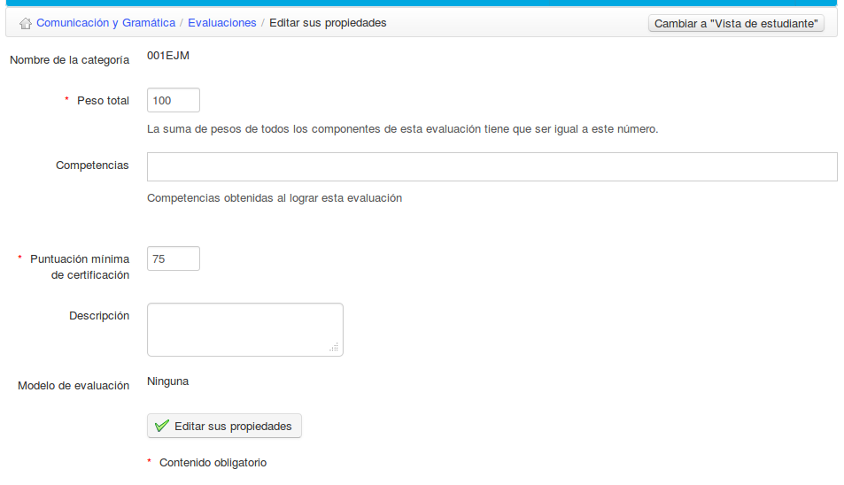
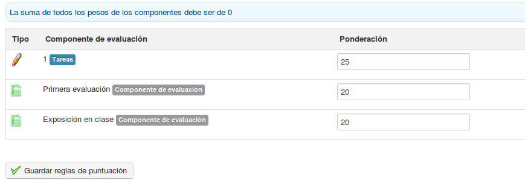
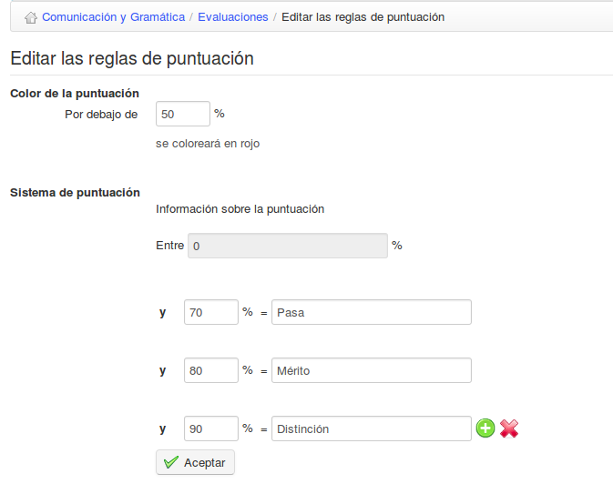
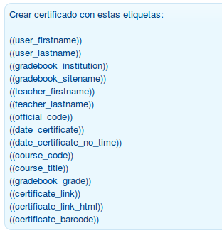

## Pre-configuración de evaluaciones {#pre-configuraci-n-de-evaluaciones}

La herramienta de evaluación, con el fin de trabajar perfectamente, requiere varios ajustes que deben de ser configurados correctamente: la ponderación de las actividades, una puntuación mínima de certificación (una nota mínima), la clasificación de las competencias, y una plantilla de certificado. Si no se ajustan correctamente se mostrará en pantalla una alerta naranja que aparecerá en la página principal de _Evaluaciones_

### Peso total y puntuación mínima de certificación {#peso-total-y-puntuaci-n-m-nima-de-certificaci-n}

Para ver y editar la configuración básica, pulsar en el icono de edición  a la derecha de la barra de herramientas:

Ilustración 119: Evaluaciones – Opciones generales

El _Peso total_ del curso es importante para la asignación de ponderaciones individuales (ver más adelante). La _Puntuación_ mínima de certificación define la nota mínima para la superación del curso.

### Pesos {#pesos}

Los pesos permiten definir la importancia relativa de cada una de las actividades (desde la plataforma o presenciales) en al evaluación. Pulsa en el icono_Peso en en informe_ __para ver la página general de pesos. (Si no tienes ninguna actividad registrada en este punto, vuelve a la sección más tarde).

Ilustración 120:Evaluaciones - Pesos

Siempre es recomendable definir el total de las ponderaciones a 100 ( o el valor equivalente total para el curso definido en la sección anterior), de lo contrario se vuelve realmente complicado entender todos los posibles problemas de las puntuaciones relativas.

### Clasificación de notas {#clasificaci-n-de-notas}

La clasificación de las notas te permite definir los rangos para las puntuaciones por lo que pueden ser representadas literal y gráficamente con mayor facilidad. Pulsa en el icono en forma de podio.

Así como un pase-marca, puede añadir opciones adicionales: por ejemplo, los nombres que desee

Ilustración 121: Evaluaciones – Rango de puntuaciones

dar a cualquier banda de nota para hacerlo más rápido para leer informes genéricos.

### Plantillas de certificado {#plantillas-de-certificado}

Finalmente es posible crear certificados generados automáticamente utilizando los datos almacenados de los alumnos en la plataforma. Para hacer esto haz clic en el icono grande de certificado  en la barra de herramienta. Esto mostrará en la pantalla la lista de certificados existentes con una barra de herramienta con la opción de importar o crear certificados. Haz clic en el icono de _Crear certificado_ __para ir a una página similar a la de la herramienta de creación de documento el cual te permitirá diseñar tu certificado

Ilustración 122: Evaluaciones – Plantilla de creación de certificado

Ilustración 123: Etiquetas para usar en la plantilla de certificado

Observa que sobre el editor principal, la página muestra una lista de etiquetas que pueden ser usadas para que el certificado muestre los datos necesarios de cada estudiante una vez que haya logrado superar los objetivos fijados en la evaluación.

La página principal de certificados muestra los certificados que han sido cargados o creados.

Ilustración 124: Evaluaciones – Relación de plantillas de certificados

Haz clic en el icono  para seleccionar este documento como la plantilla de certificado por defecto ( Se verá coloreado cuando se seleccione). Este es el certificado que será expedido a los estudiantes. Puedes volver a la pantalla de evaluaciones a través de la barra de navegación (haciendo clic en _Evaluaciones_).

Es importante notar que las reglas usadas para la entrega de certificados son las mismas que las usadas para otorgar una competencia, si esta herramienta fue activada y configurada adecuadamente.

El alumno solo recibirá su certificado o su competencia si es que visita la página de la herramienta de evaluaciones. Para ello, si la evaluación del curso se basa en una lección, por ejemplo, es buena práctica hacer que el último paso de la lección contenga un enlace a la herramienta de evaluaciones, de tal manera que el alumno pueda directamente obtener su certificado y su(s) competencia(s).

Sino, será necesario que el profesor vaya a la herramienta, genere todos los certificados de los alumnos, los imprima y los entregue en físico o virtual a los alumnos.