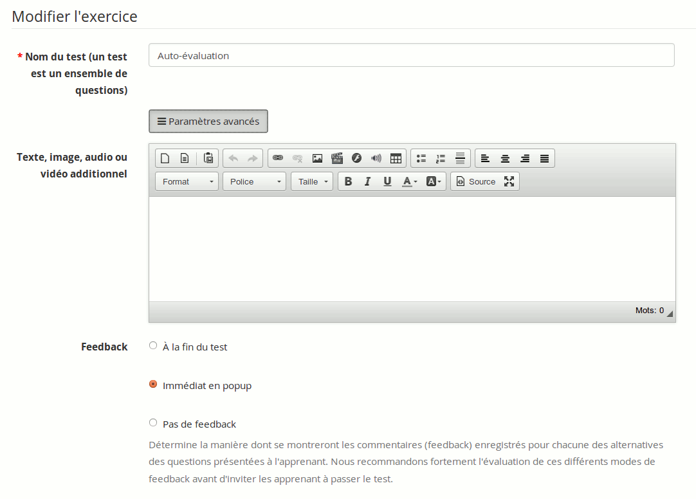
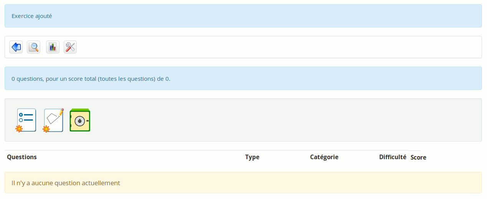
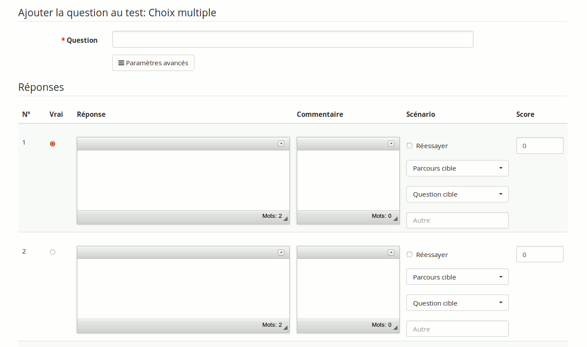
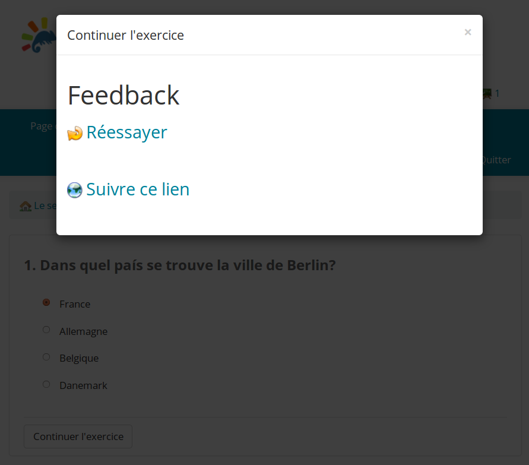
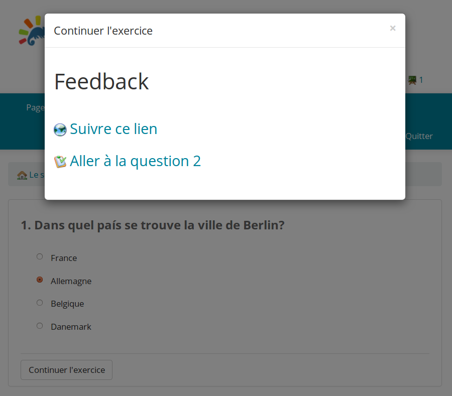
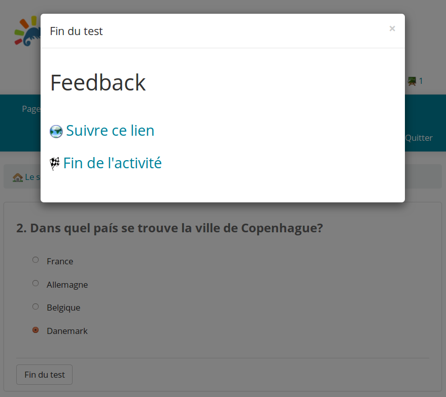

## Exercices de type feedback immédiat {#exercices-de-type-feedback-imm-diat}

Si l&#039;administrateur a activé l&#039;option de scénarisation des exercices (voir illustration),

Illustration 49: Option de configuration de la plateforme pour les exercices scénarisés

le formulaire de création des exercices offre une option additionnelle, appelée _feedback immédiat__en popup._

### Création d&#039;exercices de type auto-évaluation {#cr-ation-d-exercices-de-type-auto-valuation}

Illustration 50: Options de création d&#039;exercices – Mode feedback immédiat

En sélectionnant cette option, divers changements apparaîtront dans l&#039;interface de création de l&#039;exercice.

Premièrement, les types de questions normaux se limiteront à la sélection de questions de type réponse unique (voir section13.5.1 - Type 1 : Question à choix multiples – réponse unique) et un type de question basé sur les zones sur image (voir section13.5.6 - Type 6 : Expression orale), appelée “Délinéation”, qui est élaboré de la même manière qu&#039;une zone sur image, mais avec la possibilité d&#039;indiquer des proportions spécifiques de superficie que l&#039;apprenant devra reconnaître.

Il est important de comprendre que ce type d&#039;exercice n&#039;a pas pour objectif la génération d&#039;un score particulier pour qualifier l&#039;apprenant, mais bien de permettre à l&#039;apprenant d&#039;évaluer ses connaissance et de le féliciter lorsque, au travers d&#039;une séquence de bonnes réponses, il arrive à destination (ligne d&#039;arrivée de l&#039;exercice).

Il est également important de noter qu&#039;en cas de tentative d&#039;utilisation des résultats comme mesure d&#039;évaluation, ces résultats varieront d&#039;un apprenant à un autre étant donnée la nature adaptative du parcours d&#039;une question à une autre par les apprenants.

Illustration 51: Page de création de questions dans les exercices de feedback immédiat

Ce type d&#039;exercice requiert une préparation particulière. Comme vous pourrez le constater en créant une nouvelle question de type réponse unique, des options additionnelles à la normales s&#039;offrent à vous.

Illustration 52: Formulaire de création de questions en mode de scénarisation

Analysons les champs qui apparaissent dans la colonne « Scénario ». Tous suggèrent une proposition différente à l&#039;apprenant. Ces propositions apparaîtront à l&#039;apprenant juste après qu&#039;il ait répondu.

*   Réessayez: permettra à l&#039;apprenant d&#039;essayer à nouveau la même option

*   Parcours cible : permettra de faire un lien direct vers un des parcours du même cours, ayant l&#039;effet d&#039;un indice de ce que l&#039;apprenant devrait réviser pour trouver la réponse correcte

*   Question cible : permettra de faire un lien direct vers une question de suivi. Il s&#039;agit de l&#039;étape qui permet la génération d&#039;un test adaptatif, étant donné que l&#039;apprenant pourra poursuivre un chemin décisionnel prédéterminé avec différentes options avant de terminer l&#039;exercice. Une des possibilités est Sortir du test. Elle représente un point de sortie au travers duquel l&#039;apprenant peut arriver à la fin du test.

*   Autre: permettra de définir un lien externe vers lequel rediriger l&#039;apprenant. Cela peut être un lien vers Wikipedia, par exemple, ouvers n&#039;importe quel site web ou ressource avec un URL, ou même vers une ressource quelconque de Chamilo. Le lien doit inclure le protocole (http://, https://, skype://) et être un URL valide et identifiable par le navigateur

Toutes ces options peuvent être combinées de telle manière que l&#039;apprenant ait différentes options au moment d&#039;obtenir la rétro-alimentation relative à sa réponse.

### Planification des exercices d&#039;auto- évaluation {#planification-des-exercices-d-auto-valuation}

Comme on a pu l&#039;observer dans la section précédente, au moment de créer une nouvelle question, il est déjà possible de sélectionner la question suivante. Ceci signifie que la question suivante **doit** exister.

Pour le design de ce type d&#039;exercices, il est donc bon de planifier les chemins que les apprenants pourront prendre dans son parcours. Cela signifie qu&#039;il est nécessaire de planifier ces chemins, et quelle meilleure manière de le faire qu&#039;un diagramme décisionnel ?

Dans le diagramme suivant, les questions, représentées par des numéros, ont des destinations distinctes selon la réponse donnée par l&#039;apprenant (dans ce cas, une réponse erronée envoie à gauche alors qu&#039;une réponse correcte envoie à droite ou vers le bas). Comme on peut l&#039;observer, il est critique de penser à toutes les possibilités et de ne laisser aucune question sans destination possible, tant en cas de réponse correcte qu&#039;en cas de réponse erronée.

Objet OLEIllustration 53: Exemple de diagramme décisionnel d&#039;un exercice scénarisé

Dans ce cas, seuls 4 niveaux de questions existent avant d&#039;arriver à la fin (ou 4 questions maximum). Ceci suggère que, pour une auto-évaluation de 4 niveaux, il faudra toujours penser à élaborer le double ou le triple de questions.

Les questions devraient également être identifiées de manière spéciale par l&#039;enseignant, pour éviter de les mélanger avec les questions d&#039;un exercice normal, étant donné qu&#039;elles ne disposent pas de ces « destinations » et de ces propriétés particulières.

### Apparence des auto-évaluations pour l&#039;apprenant {#apparence-des-auto-valuations-pour-l-apprenant}

L&#039;apprenant qui passe un test d&#039;auto-évaluation scénarisé verra un écran différent de celui des exercices normaux à la fin de chaque question. Sur cette écran, il verra une information de rétro-alimentation immédiate mais il pourra aussi décider (dans le cas de différentes possibilités) de la prochaine étape.

Illustration 54: Auto-évaluation scénarisée: Cas de réponse incorrecte – Essayez à nouveau

Illustration 55: Auto-évaluation scénarisée: Cas de réponse correcte – Passer à la suivante

Illustration 56: Auto-évaluation scénarisée: Cas de réponse correcte et fin
