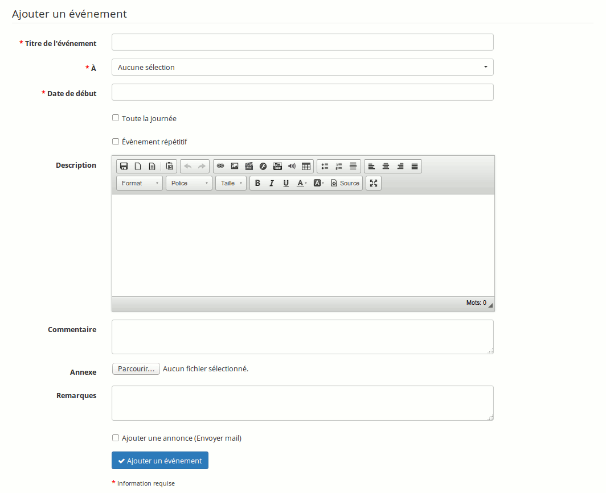

## Ajouter un événement dans l&#039;agenda d&#039;un cours {#ajouter-un-v-nement-dans-l-agenda-d-un-cours}

*   cliquez sur le lien « Ajouter un événement », (alternativement, cliquer sur une case du calendrier pour y ajouter un événement fonctionne également, bien que le formulaire soit sensiblement plus court de cette manière)

*   indiquez un titre d&#039;événement

*   cliquez sur le lien «À » pour choisir les destinataires de l’événement. Les sélections multiples sont possibles. Maintenez la touche « Ctrl » enfoncée pour sélectionner des destinataires non consécutifs,

*   complétez les dates de « Début » et de « Fin » en cliquant dans la zone « Date de début ». Le formulaire apparaissant comme une popup peut se révéler un peu impressionnant la première fois, mais il s&#039;agit simplement d&#039;un double calendrier (début et fin) avec quelques options en plus pour les utilisateurs en puissance,

*   indiquez s&#039;il s&#039;agit d&#039;un événement durant toute la/les journée(s)

*   si l’événement est répétitif, cochez la case « Événement répétitif», renseignez le type de cycle et sa date de fin (jour, semaine, mois, année),

*   ajoutez une description de l’événement (il est possible d&#039;insérer une image, une vidéo, un lien),

*   indiquez facultativement un commentaire ou une remarque (n&#039;oubliez pas que l&#039;événement peut être envoyé à une seule personne à la fois),

*   associez éventuellement un document joint en cliquant sur le lien « Annexe » puis sur le bouton « Parcourir »,

*   décidez si vous souhaitez que l&#039;événement soit copié sous forme d&#039;annonce pour être envoyé par courriel aux apprenants sélectionnés

*   cliquez sur le bouton « Ajouter un événement » pour ajouter l’événement à la liste.

Illustration 154: Agenda - Création
