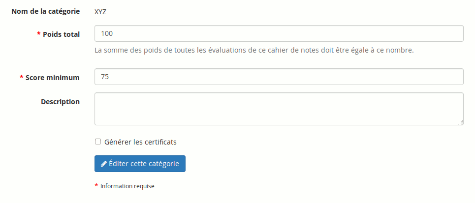
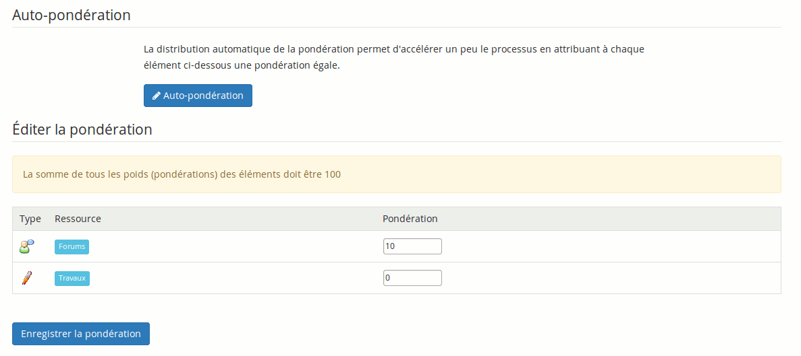
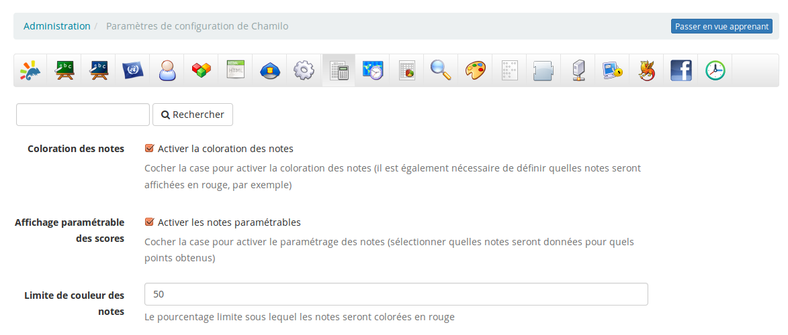
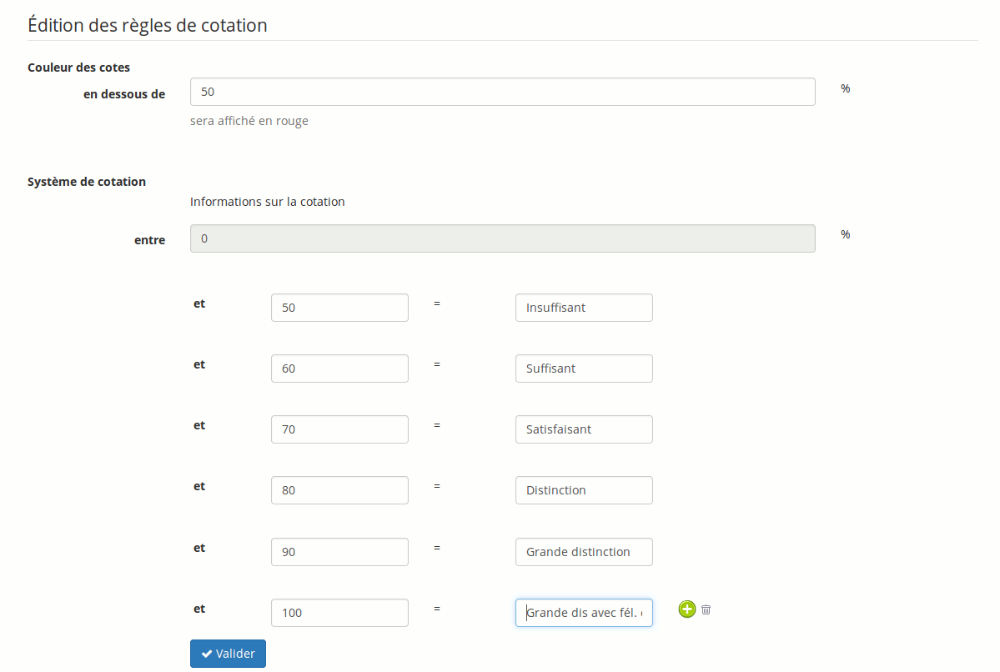
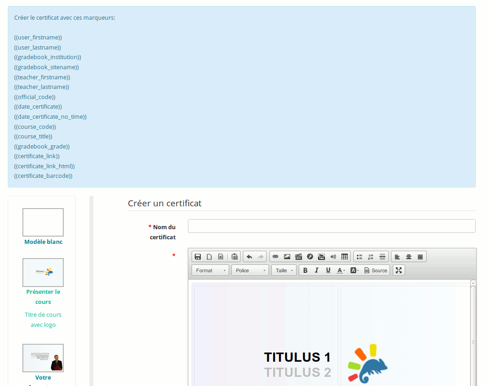

## Préconfiguration du cahier de notes {#pr-configuration-du-cahier-de-notes}

L&#039;outil de cahier de notes, pour fonctionner dans son intégralité, exige la configuration de règles de score, de pondérations et d&#039;un modèle de certificat.

### Poids total et score minimum {#poids-total-et-score-minimum}

Jetez un œil sur les paramètres génériques du cahier de notes en cliquant sur l&#039;icône de crayon **en haut à droite** de l&#039;écran.

Illustration 107: Cahier de notes - Édition

L&#039;élément « Catégorie » représente en fait le cahier de note en soi, et le cahier de note de plus haut niveau (nous verrons plus tard qu&#039;il est possible d&#039;en créer d&#039;autres) utilise le code du cours par défaut.

Le poids total est important pour les pondérations (voir ci-après). Le score minimum est ce qui définit si l&#039;apprenant a atteint l&#039;objectif pédagogique du cours.

L&#039;option de génération de certificats a été placée là pour empêcher la génération automatique de certificats si elle n&#039;est pas souhaitée lors de l&#039;obtention du score minimum par un apprenant.

Une description peut être ajoutée au cahier de notes, mais c&#039;est rarement nécessaire.

### Poids total {#poids-total}

La pondération permet de définir le poids relatif de chacune des évaluations (présentielles ou non) au sein du cahier de notes. Cliquez sur l&#039;icône de pourcentage (« _Pondération_ ») depuis la page principale de l&#039;outil pour aller à la page de configuration des pondérations.

Illustration 108: Cahier de notes - Pondérations

Il est toujours recommandé de définir les pondérations comme ayant un total de 100 (ou de la valeur configurée au chapitre précédent), sinon il peut être vraiment compliqué de résoudre tous les problèmes de poids relatifs. Une fois plus habitué à la gestion de ces cahiers de notes, n&#039;hésitez pas à donner libre cours à vos règles d&#039;évaluations.

Notez qu&#039;une section « Auto-pondération » est disponible, qui permet de répartir la pondération de façon égale pour toutes les ressources, option pratique lorsque vous disposez de nombreuses ressources dans votre cahier de notes. Il est possible d&#039;encore modifier ces pondérations une fois cette option sélectionnée.

### Règles de scores {#r-gles-de-scores}

Cette option doit tout d&#039;abord être activée par l&#039;administrateur, sans quoi l&#039;icône correspondante n&#039;apparaîtra pas dans votre cours. Pour cela, l&#039;administrateur devra activer les options telles qu&#039;indiquées dans la capture d&#039;écran ci-dessous

Il n&#039;y a pas de conséquences négative à proprement parler du fait d&#039;activer la coloration et le paramétrage des scores, mais certains administrateurs pourraient juger que les options additionnelles activées sont peu utiles et génèrent de la confusion. C&#039;est probablement un thème à débattre en petit comité...

Les règles de score permettent de définir des rangs de scores de telle sorte qu&#039;ils puissent être représentés littéralement et graphiquement.

Cliquez sur l&#039;icône symbolisant un podium (si vous ne la voyez pas, indiquez la section ci-dessus à votre administrateur).

La façon la plus rapide de configurer l&#039;écran suivant est d&#039;indiquer « 50 » comme valeur de coloration en rouge, puis de cliquer 5 fois sur l&#039;icône de « + » vert. Ensuite, complétez comme indiqué sur la capture d&#039;écran suivante.

Le même écran se charge à nouveau avec des options additionnelles. Complétez-les selon vos besoins. Inspirez-vous si nécessaire de la capture d&#039;écran de l&#039;Illustration 110. L&#039;idée du système est permettre une catégorisation des notes, comme nous allons le voir ci-après.

Illustration 109: Cahier de notes - Règles de scores

Une fois ces règles de scores mises à jour, la vue linéaire des résultats (voir section 19.4Vue linéaire en page 118) devient beaucoup plus visuelle.

### Modèle de certificat {#mod-le-de-certificat}

Il est possible de créer un certificat qui puisse être généré automatiquement avec les données des utilisateurs. Pour cela, cliquez sur la grande icône de certificat. Vous arrivez dans un outil similaire à l&#039;outil de documents.

Illustration 110: Cahier de notes - Liste de certificats

Vous pouvez y éditer le certificat par défaut, créer un nouveau certificat ou en télécharger un depuis votre ordinateur (au format HTML) sur le serveur.

Si vous décidez d&#039;en créer un nouveau, cliquez sur la première icône en haut à gauche.

Illustration 111: Cahier de note - Création d&#039;un modèle de certificat

Vous trouverez quelques marqueurs dans la partie supérieure de la page.

Si vous placez n&#039;importe lequel de ces marqueurs dans votre modèle de certificat, celui-ci sera automatiquement remplacé par la valeur qui lui correspond, selon le contexte. Par exemple, _((user_firstname))_ sera remplacé par le prénom de l&#039;utilisateur dont le certificat est généré.

Illustration 112: Cahier de notes - Sélection du certificat actif

Une fois de retour dans la liste de certificats, cliquez sur l&#039;icône de sélection du certificat actif (icône encadrée dans l&#039;illustration) pour qu&#039;elle se colore. Enfin, revenez à l&#039;écran du cahier de notes grâce à la navigation horizontale.