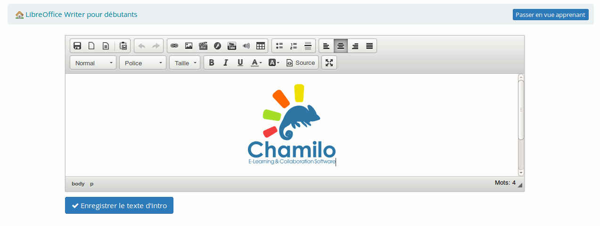

## Texte d&#039;introduction {#texte-d-introduction}

En dehors de tout outil en particulier, il est possible de composer un message d&#039;accueil au cours. Cliquez sur le lien « Ajouter un texte d&#039;introduction », un éditeur de texte apparaît :

Illustration 21: Page d&#039;accueil du cours - Texte d&#039;introduction

Cette fonctionnalité, bien qu&#039;à l&#039;air anodine, est en fait très puissante : il est possible de redessiner l&#039;entièreté de la page du cours en masquant tous les outils et en plaçant vos propres icônes. Pour cela :

*   cachez tous les outils (en cliquant sur l&#039;œil, dont l&#039;état doit être _fermé_ et gris)

*   cliquez droit sur l&#039;un des outils que vous voulez offrir à vos étudiants

*   sélectionnez _Copier l&#039;adresse de ce lien_

*   cliquez gauche sur _Ajouter un texte d&#039;introduction_

*   placez un texte d&#039;introduction (n&#039;hésitez pas à faire appel à l&#039;outil de création de tableau pour placer vos éléments avec plus de facilité dans l&#039;espace) et une icône symbolisant, selon vous, l&#039;outil auquel vous désirez donner accès

*   cliquez sur l&#039;icône pour la sélectionner, puis cliquez sur l&#039;icône de création de lien (un maillon de chaîne avec une mappemonde en image de fond)

*   « collez » le lien que vous aviez sauvegardé quelques étapes ci-dessus (CTRL-V fonctionne très bien également)

*   enregistrez le tout

Vous disposez maintenant d&#039;une page de cours personnalisée. Seuls persistent l&#039;en-tête du campus et son pied de page.