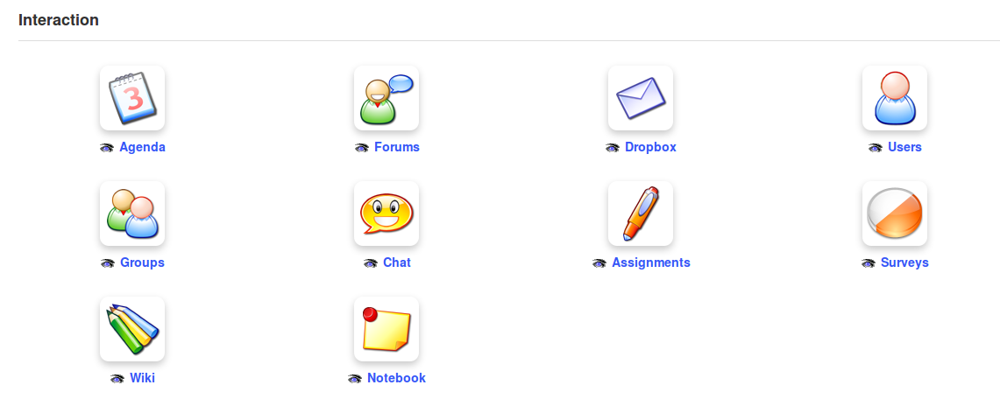

## Ferramentas de interacción {#ferramentas-de-interaccion}

O obxetivo da sección de interacción é brindar ferramentas que permitan a comunicación entre docentes e alumnos, así como entre alumnos. A diferenza que coas ferramentas de producción, o docente non é o único que pode usalas.

Ilustración 27: Ferramentas de Interacción

### Axenda {#axenda}

Esta ferramenta permite aos alumnos ter unha axenda do curso na que poden, ademáis de ver eventos que están por vir, engadir os seus.

### Compartir documentos {#compartir-documentos}

Esta ferramenta permite aos usuarios compartir documentos entre si.

### Grupos {#grupos}

Esta ferramenta permite a creación de grupos dentro do curso.

### Tarefas {#tarefas}

Esta ferramenta permite crear tarefas para que os estudantes as realicen online ou para que as fagan offline e despois as envíen para que o profesor as avalíe. A ferramenta de tarefas está completamente integrada coa ferramenta de informes, permitindo evaluacións rápidas, e facilita o seguimiento de tarefas e resultados obtidos nas mesmas por cada alumno.

### Wiki {#wiki}

A wiki é unha ferramenta para estimular a colaboración entre os estudantes e o profesor. Proporciona unha sencilla interface para a producción en común de documentación de aula.

### Foro {#foro}

A completa ferramenta de foro permite a creación e xestión de diferentes foros que poden utilizar os usuarios do curso, e inclúe a utilidade de citar posts de estudantes e editar, marcar ou indicar notas sobre o seu trabajo en cualqueira forma que o profesor estime oportuna para apoiar o aprendizaxe.

### Usuarios {#usuarios}

Esta ferramenta permite aos docentes ver quen está inscrito no curso, e poden xestionar usuarios, inscribindo profesores e estudantes, e importar e exportar a lista de participantes se se desexa.

A ferramenta de usuarios tamén está integrada coa ferramenta _Grupos_.

### Chat {#chat}

Chamilo proporciona unha sencilla utilidade de chat mediante texto, que permite aos usuarios interactuar online con outros usuarios na plataforma.

### Enquisas {#enquisas}

A completa ferramenta de enquisas é un potente medio para invitar aos usuarios a ofrecer a súa retroalimentación e comentarios sobre a evaluación e o desenvolvemento do curso. Esta ferramenta tamén soporta a análise dos resultados recollidos dos participantes.

### Notas personais {#notas-personais}

A veces un estudante ou un profesor quere conservar notas relevantes para o seu traballo no curso. A ferramenta de notas personais proporciona unha forma sinxela de escribir, almacenar e organizar notas na plataforma para o seu propio uso, empregando o editor online. As notas creadas por esta ferramenta son privadas: ningún usuario tene aceso ás notas de outro usuario.

### Videoconferencia {#videoconferencia}

Na actualidade é relativamente fácil, utilizando un servidor local de videoconferencia, instalar esta ferramenta nun curso de Chamilo, ainda que segue seendo unha extensión externa que non está sempre dispoñible nun portal clásico. Chamilo 1.9 soporta BigBlueButton 0.8, software de código libre para videoconferencia que soporta grabación da pizarra e o audio dunha conferencia. A sesión de vídeo pode estar logo dispoñible dentro do propio Chamilo como unha videoteca dentro do curso. Dende o punto de vista dun profesor, ¡merece a pena presionar ao seu administrador para configurala!