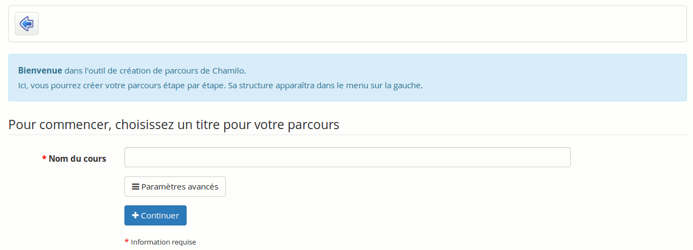
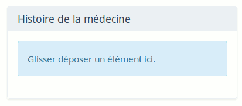
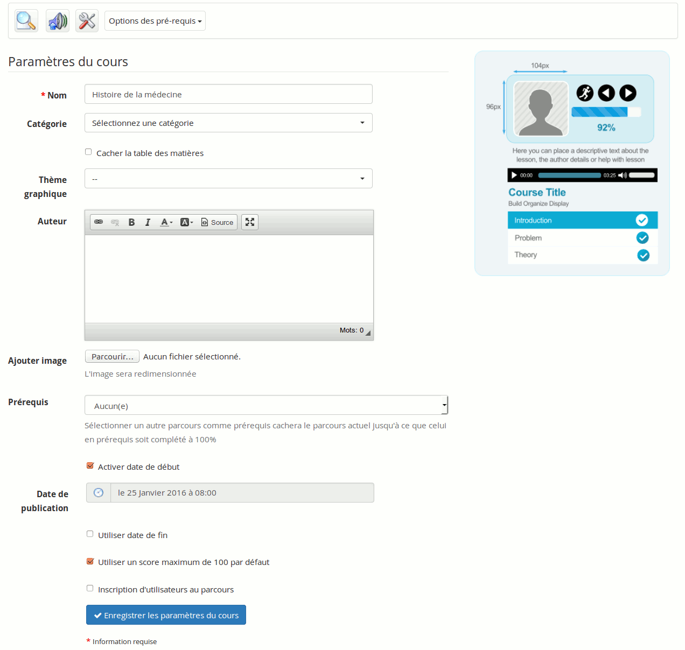

## Créer un parcours {#cr-er-un-parcours}

Cliquer sur la baguette magique : « Créer un parcours » :

Illustration 66: Parcours - Créer un parcours

Donner un nom à son parcours et cliquer sur « Continuer ». Le parcours est créé. Bien qu&#039;il soit vide de contenu, il apparaît déjà dans la liste des parcours. Une fois le parcours créé, on a accès à plusieurs outils pour créer le parcours.

Illustration 67: Parcours - Page d&#039;édition des éléments

Il est proposé :

*   de modifier les paramètres du cours avec l&#039;icône 

*   de construire le cours au travers d&#039;une zone glisser-déplacer

    

*   d&#039;ajouter une activité / un objet 

*   d&#039;ajouter une nouvelle section 

*   de prévisualiser le cours 

*   d&#039;organiser ce cours.

### Paramètres du parcours {#param-tres-du-parcours}

Modifier les informations du parcours :

Illustration 68: Parcours - Édition des propriétés

Ce cadre gris sera le fil d&#039;Ariane lors de la visualisation du parcours par les apprenants. Les différentes parties seront visibles et accessibles en un clic de souris.