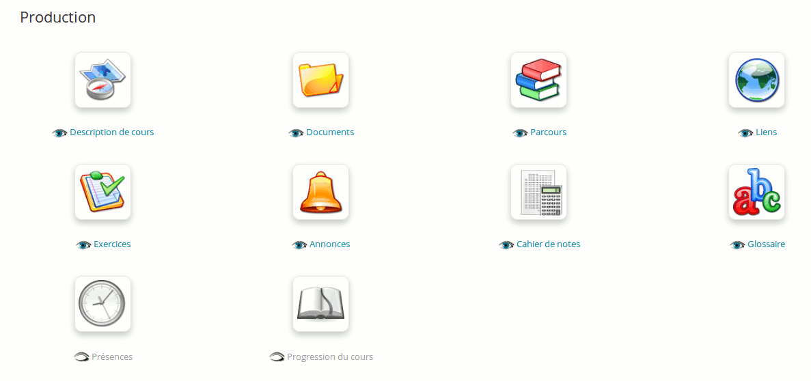

## Introduction {#introduction}

Un parcours est une séquence d&#039;apprentissage découpée en sections qui contiennent des activités ou des objets d’apprentissage. Il peut être organisé en fonction d&#039;un contenu. Il constituera une sorte de table des matières, ou bien, en fonction des activités, il s&#039;apparentera à un agenda de « choses à faire » pour acquérir la maîtrise d&#039;un savoir, d&#039;une compétence.

En plus d&#039;être structuré, un cours peut être séquencé. Cela signifie que certaines sections ou activités

peuvent constituer des pré-requis pour d&#039;autres (impossible d&#039;accéder à l’activité B avant d&#039;avoir parcouru l’activité A).

La séquence peut être suggestive (montrer les sections l&#039;une après l&#039;autre) ou contraignante (l&#039;apprenant est obligé de suivre les sections dans un ordre imposé). Il est important de comprendre qu&#039;un parcours est plus que le découpage d&#039;une matière : c&#039;est un itinéraire à travers le savoir qui inclut potentiellement des épreuves, des temps de discussions, d&#039;évaluation, d&#039;expérimentation...

Une fois identifié, aller dans l&#039;onglet « Mes cours » puis cliquer sur celui désiré.

Dans le cours ci-dessous, il est possible de créer un parcours en cliquant sur « Parcours », la troisième icône de la première ligne :

Illustration 64: Parcours - Accès depuis la page de cours

Une fois dans ce cours, il est proposé de créer un parcours ou d&#039;importer un AICC et SCORM, mais aussi de modifier un parcours existant :

Illustration 65: Parcours - Liste des parcours

Depuis la version 1.10, on y retrouve aussi (sous forme de la première icône) la possibilité de créer des catégories de parcours, fonctionnalité particulièrement utile si vous gérez des cours contenant plus de 10 parcours.