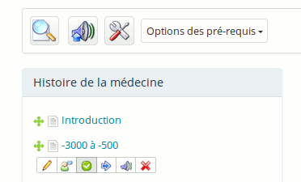
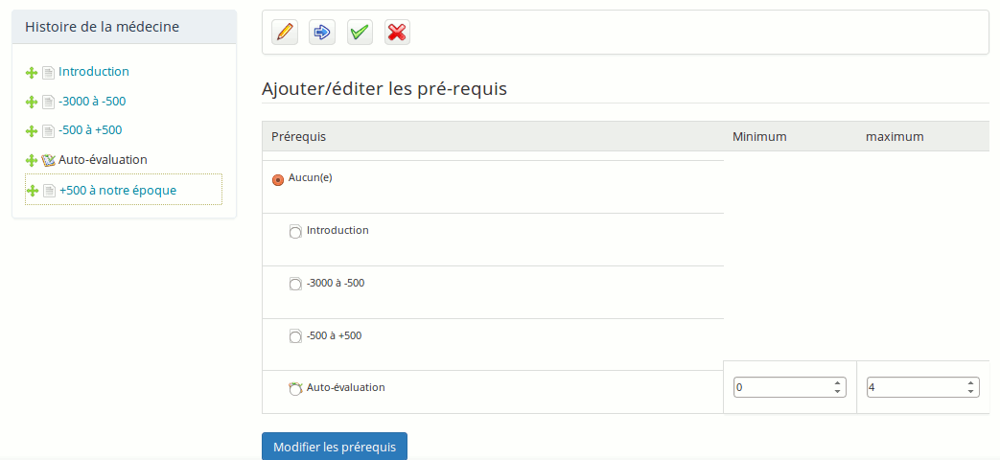

## Les « pré-requis » {#les-pr-requis}

Lorsque l&#039;on veut créer un parcours et l&#039;utiliser comme administrateur de cours, plusieurs options sont disponibles.

Si un parcours contient plusieurs pages, il est possible de préciser le but de l&#039;organisation du parcours et l&#039;utilisation que l&#039;apprenant doit en faire par le biais des « pré-requis ».

Cet outil est accessible dans la construction du parcours, tant au travers du menu déroulant qu&#039;au travers du menu flottant au-dessus de chaque élément:

Il permet à l&#039;enseignant d&#039;obliger l&#039;apprenant à lire le parcours pour accéder à la « marche » supérieure, à réaliser l&#039;exercice pour continuer, etc.

Pour l&#039;utiliser, cliquer sur une page et l&#039;outil apparaîtra dans le menu. Il ne reste plus qu&#039;à choisir les étapes obligatoires.

Illustration 83: Parcours - Sélection des pré-requis

Au travers de la liste déroulante « Options des prérequis », les éléments peuvent être configurés tous d&#039;un coup, de telle sorte que chaque élément ait comme prérequis le fait d&#039;avoir complété l&#039;élément antérieur. Il s&#039;agit d&#039;une option simple et rapide pour forcer les apprenants à suivre le fil du parcours dans l&#039;ordre.